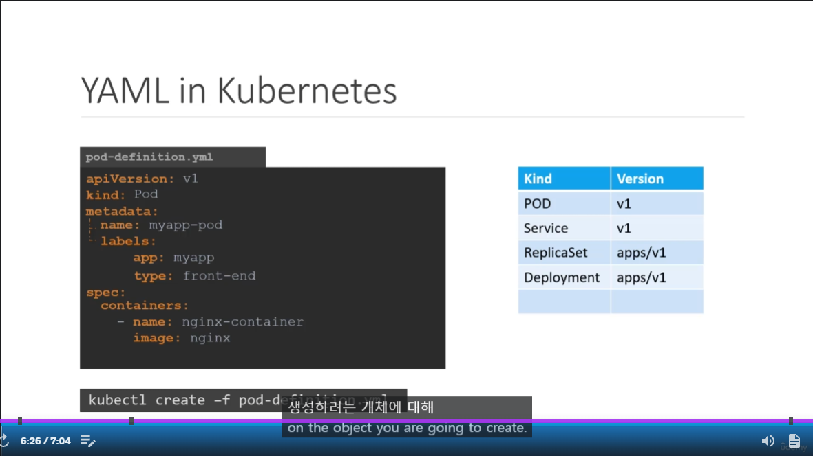
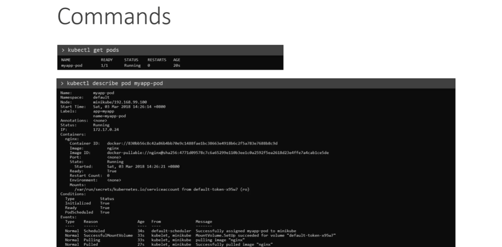

# YAML 파일을 사용하여 파드 생성하기

### POD 생성 by .yaml

- apiVersion : 쿠버네티스 API 버전
  - v1
- kind : 생성할 리소스 유형
  - Pod
- metadata : 리소스 이름, 네임스페이스 등
  - name : 리소스 이름
  - labels : 리소스 라벨
    - app : nginx
  - namespace : 리소스가 속한 네임스페이스
- spec : 리소스 설정
  - containers : 컨테이너 설정 (배열)
    - name : 컨테이너 이름
    - image : 컨테이너 이미지
    - ports : 컨테이너 포트

### POD 정보 확인

```
kubectl get pods
```

```
kubectl describe pod myapp-pod
```

### create, apply, run 명령어 차이점
```
kubectl run nginx --image=nginx
```
진짜 단순히 테스트만 할때 run (지양)
```
kubectl create -f pod.yaml
```

```
kubectl apply -f pod.yaml
```
- `create`는 이미 같은 이름의 Pod가 있다면 오류를 발생
- `apply`는 이미 같은 이름의 Pod가 있다면 업데이트

