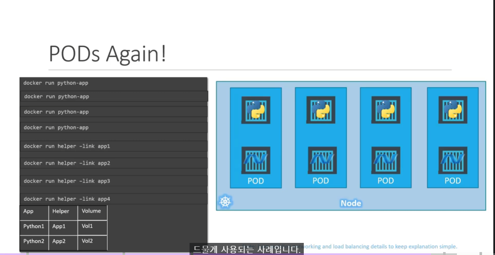

# 파드(Pods)
  - [비디오 튜토리얼](https://kodekloud.com/topic/pods-2/)로 이동하기
  
이 섹션에서는 파드(POD)에 대해 알아보겠습니다.
- 파드 소개
- 파드를 어떻게 배포하나요?

#### Kubernetes는 컨테이너를 워커 노드에 직접 배포하지 않습니다.
- Pod는 k8s에서 가장 작은 객체

  
  
#### 다음은 단일 도커 컨테이너에서 실행되는 애플리케이션의 단일 인스턴스가 파드에 캡슐화되어 있는 단일 노드 쿠버네티스 클러스터입니다.


#### 파드는 애플리케이션을 실행하는 컨테이너와 1:1 관계를 가집니다.
- 확장하려면 파드를 생성하고, 축소하려면 파드를 삭제.

  
  
## 멀티 컨테이너 파드
- 하나의 파드는 여러 개의 컨테이너를 가질 수 있습니다. 단, 일반적으로 **`동일한 종류`**의 여러 컨테이너를 포함하지는 않습니다.
  
  
  
## 도커 예시 (도커 링크)
  - k8s를 사용하지 않으면
    - 메인 컨테이너 - 서브 컨테이너 간 매핑
    - Volume 매핑
    - 컨테이너 종료 시 함께 삭제
    - .. 등의 일을 직접 해줘야 한다.
  
  

## 파드를 어떻게 배포하나요?
이제 **`kubectl`**을 사용하여 nginx 파드를 생성하는 방법을 살펴보겠습니다.

- 파드를 생성하여 도커 컨테이너를 배포하는 방법:
  ```
  $ kubectl run nginx --image nginx
  ```

- 파드 목록을 확인하는 방법:
  ```
  $ kubectl get pods
  ```

 

K8s 참조 문서:
- https://kubernetes.io/docs/concepts/workloads/pods/pod/
- https://kubernetes.io/docs/concepts/workloads/pods/pod-overview/
- https://kubernetes.io/docs/tutorials/kubernetes-basics/explore/explore-intro/


