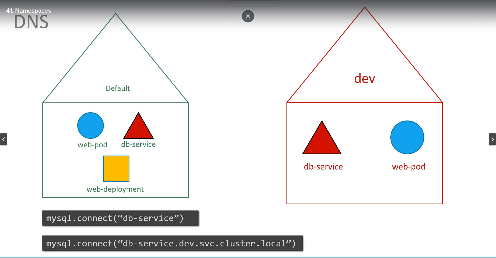
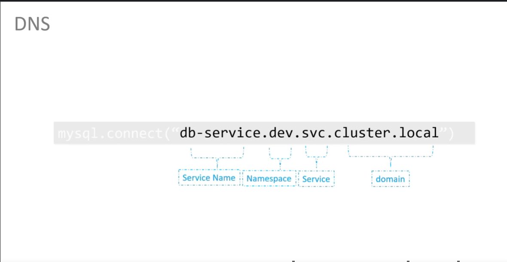

# 네임스페이스
  - [비디오 튜토리얼](https://kodekloud.com/topic/namespaces/)로 이동하기
  
이 섹션에서는 **`네임스페이스`** 에 대해 알아보겠습니다.

지금까지 우리는 클러스터에서 **`POD`**, **`Deployment`**, **`Service`** 와 같은 **`오브젝트`** 들을 생성했습니다. 우리가 했던 모든 작업은 **`네임스페이스`** 안에서 이루어졌습니다.
- 이 네임스페이스는 쿠버네티스의 **`default`** 네임스페이스입니다. 쿠버네티스가 처음 설정될 때 자동으로 생성됩니다.
- `kube-system` 네임스페이스는 쿠버네티스 시스템 컴포넌트들이 사용하는 네임스페이스.
- `kube-public`

  
 
- 자신만의 네임스페이스를 생성할 수도 있습니다.
  - Dev, Prod Namespace를 만들어서 서로에게 영향이 가지 않도록 구성 가능.
- 각 네임스페이스 마다 리소스 할당량 설정 가능

  
  
- 기본 네임스페이스의 파드를 나열하려면
  ```
  $ kubectl get pods
  ```
- 같은/다른 네임스페이스 객체에 접근할 때 접근 방식 다름


 ^7mcn0s
- **`kubectl get pods`** 명령어는 default 네임스페이스에 있는 파드만 나열
  - 다른 네임스페이스의 파드를 나열하려면 **`--namespace`** 플래그나 인자를 사용
  ```
  $ kubectl get pods --namespace=kube-system
  ```
  
  
  
- 여기에는 파드 정의 파일이 있습니다. 파드 정의 파일로 파드를 생성하면, 파드는 기본 네임스페이스에 생성됩니다.
```
apiVersion: v1
kind: Pod
metadata:
  name: myapp-pod
  labels:
     app: myapp
     type: front-end
spec:
  containers:
  - name: nginx-container
    image: nginx
```
  ```
  $ kubectl create -f pod-definition.yaml
  ```
- 다른 네임스페이스에 파드를 생성하려면 **`--namespace`** 옵션을 사용하세요.
  ```
  $ kubectl create -f pod-definition.yaml --namespace=dev
  ```
  

- 이 파드가 항상 **`dev`** 환경에서 생성되도록 하려면, 명령줄에서 지정하지 않더라도 파드 정의 파일에 **`--namespace`** 정의를 이동할 수 있습니다.
```
apiVersion: v1
kind: Pod
metadata:
  name: myapp-pod
  namespace: dev
  labels:
     app: myapp
     type: front-end
spec:
  containers:
  - name: nginx-container
    image: nginx
```
  
  
  
- 새로운 네임스페이스를 생성하려면, 아래와 같이 네임스페이스 정의를 작성한 후 **`kubectl create`**를 실행하세요.
```
apiVersion: v1
kind: Namespace
metadata:
  name: dev
```

  ```
  $ kubectl create -f namespace-dev.yaml
  ```
  네임스페이스를 생성하는 또 다른 방법
  ```
  $ kubectl create namespace dev
  ```
  
  
- 기본적으로 우리는 **`default`** 네임스페이스에 있습니다. 특정 네임스페이스로 영구적으로 전환하려면 아래 명령어를 실행하세요.
  ```
  $ kubectl config set-context $(kubectl config current-context) --namespace=dev
  ```
- 모든 네임스페이스의 파드를 보려면
  ```
  $ kubectl get pods --all-namespaces
  ```
  
  
- 네임스페이스에서 리소스를 제한하려면 리소스 쿼터를 생성하세요. 리소스 쿼터를 생성하려면 **`ResourceQuota`** 정의 파일로 시작하세요.
```
apiVersion: v1
kind: ResourceQuota
metadata:
  name: compute-quota
  namespace: dev
spec:
  hard:
    pods: "10"
    requests.cpu: "4"
    requests.memory: 5Gi
    limits.cpu: "10"
    limits.memory: 10Gi
```
  ```
  $ kubectl create -f compute-quota.yaml
  ```
  
  
K8s 참조 문서:
- https://kubernetes.io/docs/concepts/overview/working-with-objects/namespaces/
- https://kubernetes.io/docs/tasks/administer-cluster/namespaces-walkthrough/
- https://kubernetes.io/docs/tasks/administer-cluster/namespaces/
- https://kubernetes.io/docs/tasks/administer-cluster/manage-resources/quota-memory-cpu-namespace/
- https://kubernetes.io/docs/tasks/access-application-cluster/list-all-running-container-images/
  
  
