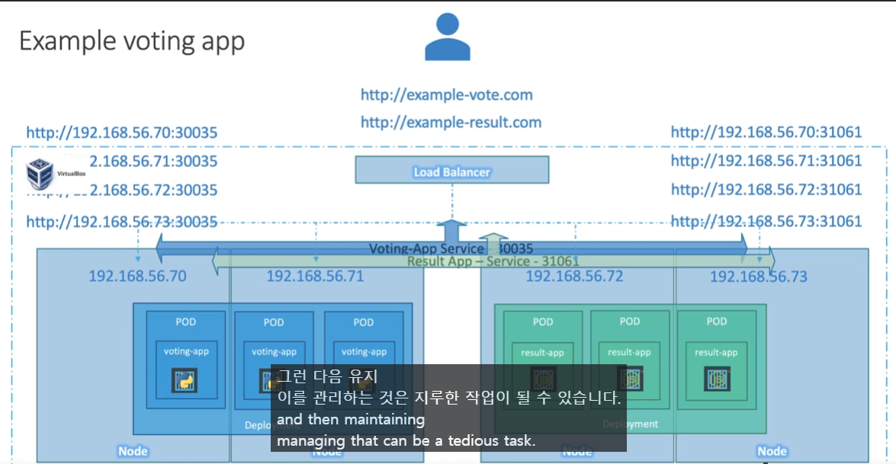

# **`서비스 - LoadBalancer`**

## LoadBalancer
- 사용자들은 변동되는 IP가 아닌 `http://example-vote.com` 처럼 같은 주소로 접근하길 원함



- 클라우드 환경에서 실행되는 쿠버네티스 클러스터를 위한 서비스 유형입니다
- 클라우드 제공자의 로드밸런서를 자동으로 프로비저닝하여 애플리케이션에 대한 외부 접근을 제공합니다
- NodePort의 확장된 형태로, 클라우드 제공자의 로드밸런서가 각 노드의 NodePort로 트래픽을 분산시킵니다

#### **클라우드 환경이 아닐 경우 `Nodeport`와 동일하게 작동**

#### LoadBalancer 서비스 생성하기
```yaml
apiVersion: v1
kind: Service
metadata:
  name: myapp-service
spec:
  type: LoadBalancer
  ports:
  - targetPort: 80    # 컨테이너 포트
    port: 80          # 서비스 포트
    nodePort: 30008   # 노드 포트 (생략 가능)
  selector:
    app: myapp
    type: front-end
```

#### LoadBalancer 서비스의 특징
- 클라우드 제공자의 로드밸런서를 자동으로 프로비저닝
- 외부에서 단일 IP를 통해 애플리케이션에 접근 가능
- 트래픽을 여러 노드에 자동으로 분산
- 고가용성과 확장성 제공

#### 서비스 생성 및 확인
```bash
# 서비스 생성
$ kubectl create -f service-definition.yaml

# 서비스 목록 확인
$ kubectl get services
```

K8s 참조 문서:
- https://kubernetes.io/docs/concepts/services-networking/service/
- https://kubernetes.io/docs/tutorials/kubernetes-basics/expose/expose-intro/ 