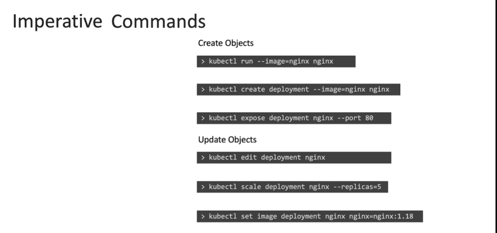
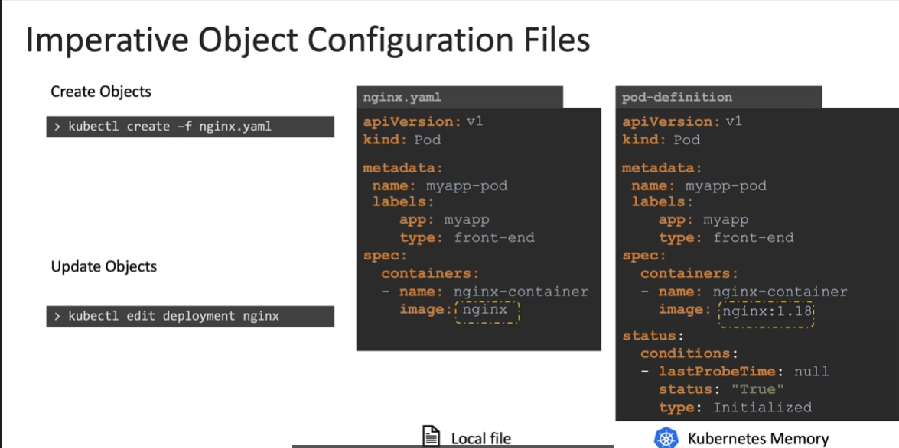
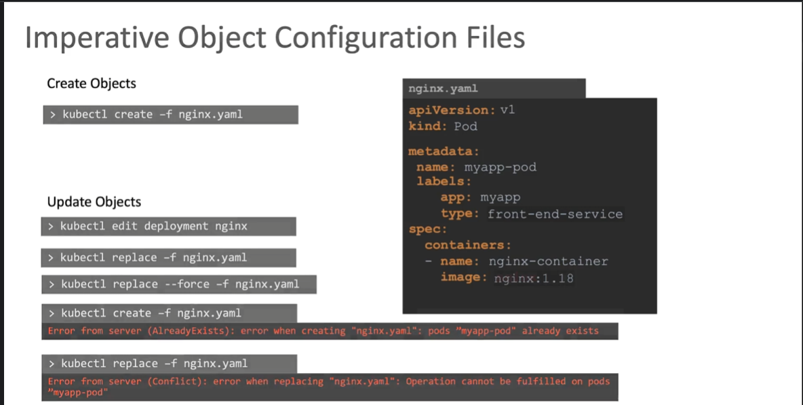
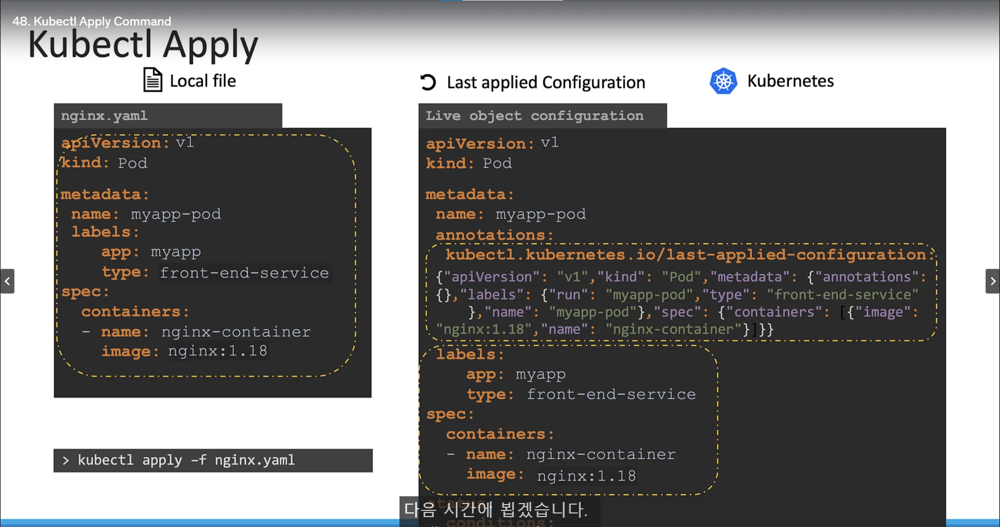

# Certification Tips - Imperative Commands with kubectl
  - Take me to the [Certification tips page](https://kodekloud.com/topic/certification-tips-imperative-commands-with-kubectl/)

### 그럼 시험에선??
- `dry-run=client`
- `-o yaml`

옵션을 열심히 사용하자.

- **Imperative Commands**
  - 명령어를 사용하여 쿠버네티스 객체를 생성하고 관리하는 방법
  - 예시 : `kubectl run nginx --image=nginx`
  - 장점 : 빠르고 간단하게 사용 가능
  - 단점 : 명령어를 사용하여 객체를 생성하기 때문에 재사용이 어려움




edit을 이용하여 수정했을 때 메모리에만 저장되고 로컬 파일에 적용 안됨.



그럼에도 명령형 방식에서 수정하고 파일에 적용하는 법
```bash
kubectl replace -f nginx-deployment.yaml
```
```bash
kubectl replace --force -f nginx-deployment.yaml
```

- **Declarative Commands**
  - 파일을 사용하여 쿠버네티스 객체를 생성하고 관리하는 방법
  - 예시 : `kubectl apply -f nginx-deployment.yaml`
  - 장점 : 파일을 사용하여 객체를 생성하기 때문에 재사용이 용이

### `kubectl apply` 적용 방식

- Local file
	  - 스토리지에 저장
- Kubernetes Live object configuration
	  - 쿠버네티스 메모리에 저장
	  - `kubectl.kubernetes.io/last-applied-configuration` 메타데이터 존재
	    - json 형태로 저장
	    - 마지막으로 적용된 configuration 저장
	    - 명령형 방식으로 선언하면 여기에 저장 같이 저장됨.
	      - 명령형 방식으로 적용한 이후 `yaml` 파일로 `apply`하려고 하면 명령형 방식이 우선이 되고 적용되지 않음.

#### 예시
1. kubectl apply -f https://k8s.io/examples/application/simple_deployment.yaml\
2. kubectl scale deployment/nginx-deployment --replicas=2
   - -> replicas become 2
3. kubectl apply -f https://k8s.io/examples/application/simple_deployment.yaml
   - replicas still = 2
   - `last-applied-configuration` 에 명령어로 저장된 값이 저장되어 있기 때문.

> [!warning]
> ### **절대 명령형 방식과 선언형 방식을 동시에 사용하지 말아라.**

   