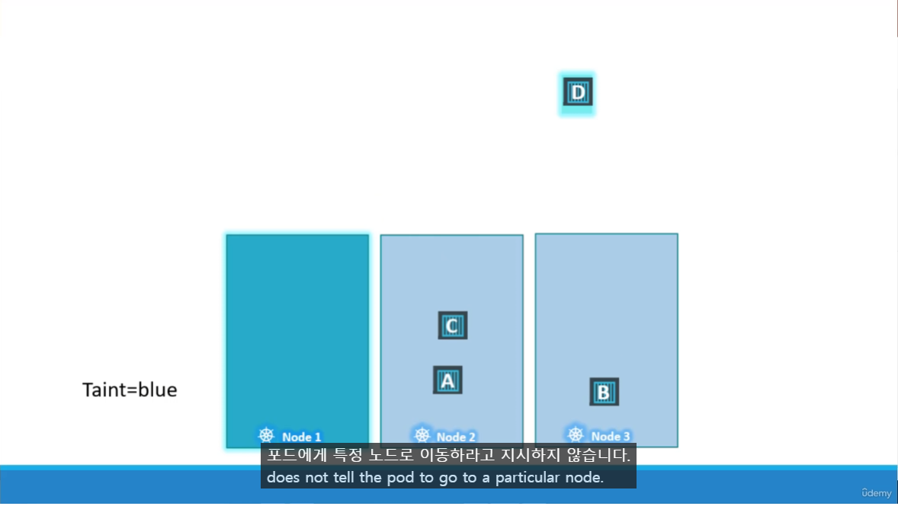

# Taint(오염)와 Toleration(관용)
  - [비디오 튜토리얼]로 이동하기 (https://kodekloud.com/topic/taints-and-tolerations-2/)
  
이 섹션에서는 Taint와 Tolerations에 대해 살펴보겠습니다.
- 파드와 노드의 관계 및 어떤 파드가 어떤 노드에 배치될 수 있는지를 제한하는 방법입니다.

#### Taint와 Tolerations는 어떤 파드가 노드에 스케줄될 수 있는지에 대한 제한을 설정하는 데 사용됩니다.
- 특정 Taint에 대해 관용이 있는 파드만 해당 노드에 스케줄됩니다.

  
  
## Taint
- **`kubectl taint nodes`** 명령어를 사용하여 노드에 Taint를 추가합니다.

  구문
  ```
  $ kubectl taint nodes <node-name> key=value:taint-effect
  ```
 
  예시
  ```
  $ kubectl taint nodes node1 app=blue:NoSchedule
  ```
  
- Taint 효과는 파드가 Taint를 견디지 못할 경우 어떤 일이 발생하는지를 정의합니다.
- Taint 효과는 3가지가 있습니다.
  - **`NoSchedule`** : Tolerantion 을 가진 파드만 스케줄
  - **`PreferNoSchedule`** : 가능하면 스케줄 하지 않음 (보장 X)
  - **`NoExecute`** : 새로운 파드를 스케줄하지 않고 내부에 있던 Tolernation이 없는 파드를 제거
  
  
  
## Tolerations
   - Tolerations는 파드 정의에 **`tolerations`** 섹션을 추가하여 파드에 추가됩니다.
   - Taint 에 맞는 Toleration 이 있어야 스케줄 가능
     ```
     apiVersion: v1
     kind: Pod
     metadata:
      name: myapp-pod
     spec:
      containers:
      - name: nginx-container
        image: nginx
      tolerations:
      - key: "app"
        operator: "Equal"
        value: "blue"
        effect: "NoSchedule"
     ```
    
  
    

#### **Taint와 Tolerations는 파드가 특정 노드로 가도록 지시하지 않습니다**. 
#### 대신, 노드가 특정 Tolerations가 있는 파드만 수용하도록 지시합니다.
- D가 Node 1 에 대한 Toleration을 가지고 있다고 해도 무조건 거기에 배치되는 것이 아님.
  - 반드시 특정 Node에 배치되길 원한다면 `Node affinity` 사용



 
 #### Master Node의 Taint
 - Master Node는 기본적으로 taint가 설정되어 있기 때문에 어떤 Pod도 스케줄되지 않음.
   - 수정은 가능하나 master Node에 배치하는 것이 Best Practice가 아님.
 - Taint를 보려면 아래 명령어를 실행
  ```
  $ kubectl describe node kubemaster | grep Taint
  ```
 
  
     
#### K8s 참조 문서
- https://kubernetes.io/docs/concepts/scheduling-eviction/taint-and-toleration/
