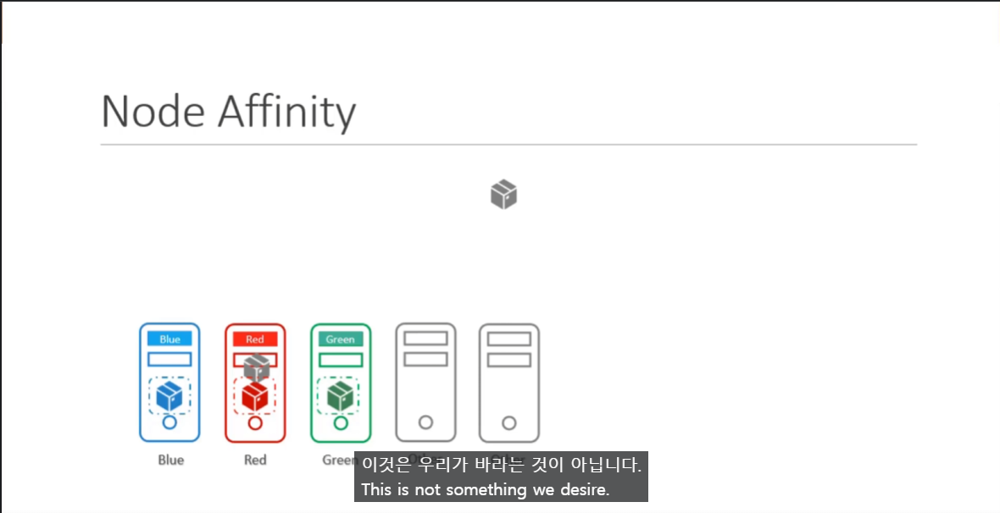

# Taints and Tolerations vs Node Affinity
  - [비디오 튜토리얼](https://kodekloud.com/topic/taints-and-tolerations-vs-node-affinity/)로 이동하기

이 섹션에서는 Taints and Tolerations와 Node Affinity를 살펴보겠습니다.
- Taints and Tolerations는 파드가 특정 노드에 배치되도록 할 수 없다.
  - 이 경우, red 파드는 taint나 toleration이 설정되지 않은 다른 노드 중 하나에 배치될 수 있습니다.
  
  
  
 - Node Affinity는 파드가 특정 노드에 배치되도록 할 수 있다.
   - 그러나 Label 이 붙어있지 않는 파드도 해당 노드에 배치될 수 있다.
  

- 따라서, taints and tolerations와 node affinity 규칙의 조합을 함께 사용
  

  
#### K8s 참조 문서:
- https://kubernetes.io/docs/concepts/scheduling-eviction/taint-and-toleration/
- https://kubernetes.io/docs/tasks/configure-pod-container/assign-pods-nodes-using-node-affinity/
