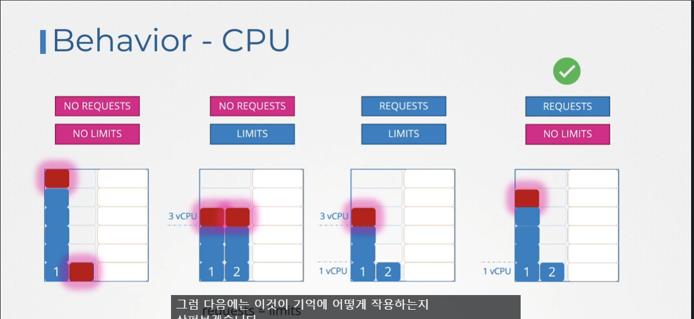
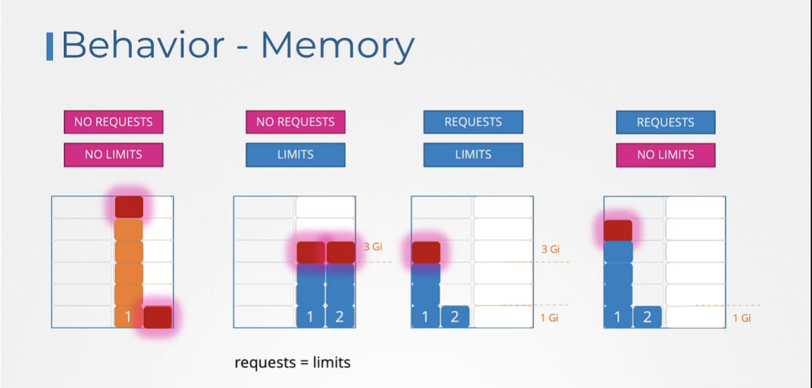
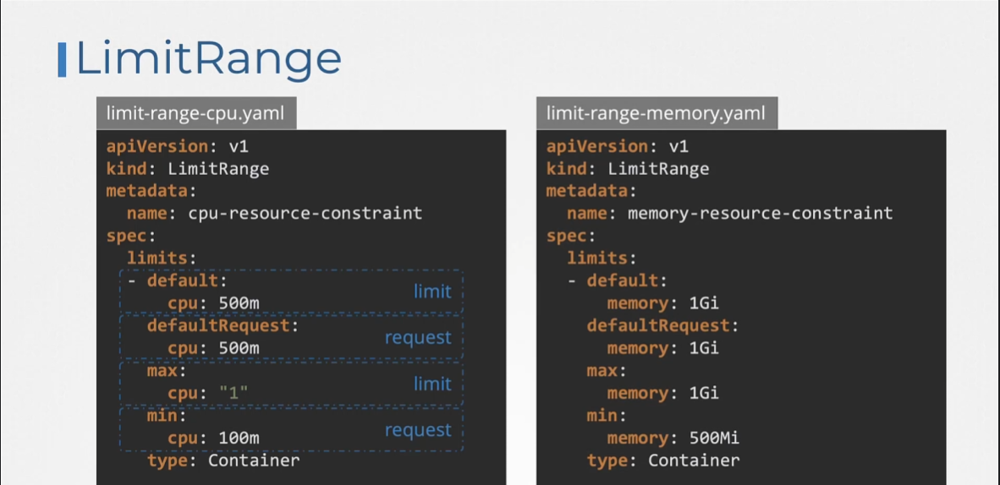
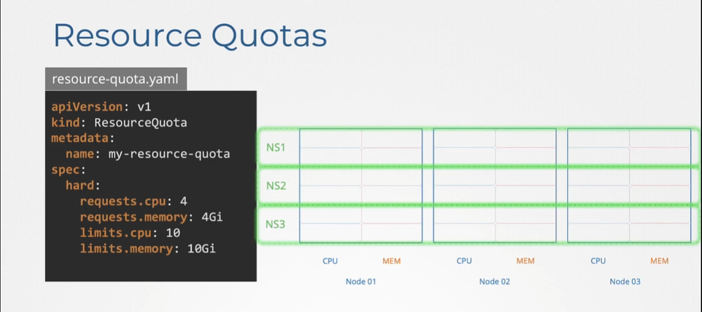

# 리소스 제한
  - [비디오 튜토리얼](https://kodekloud.com/topic/resource-limits/)로 이동하기
  
이 섹션에서는 리소스 제한에 대해 살펴보겠습니다.

#### 3개의 노드로 구성된 Kubernetes 클러스터를 살펴보겠습니다.
- 각 노드는 사용 가능한 CPU, 메모리 및 디스크 리소스 세트를 가지고 있습니다.
- 노드 중 어느 곳에도 충분한 리소스가 없으면 Kubernetes는 파드의 스케줄링을 보류합니다. 이 경우 파드는 `pending` 상태로 표시됩니다. 이벤트를 확인하면 이유가 `Ubs===`으로 나타납니다.


- CPU
	- 설정된 CPU Limit 넘을 수 없음 -> 쓰로틀링
	- 1 == AWS vCPU == 1 GCP Core == 1 Hypertread
	- 0.1 == 100m(milli)
	- 최소값은 1m
- Mem
	- 설정된 Memory Limit 을 넘길 수 있음
	- 지속적으로 Limit 보다 많은 메모리를 소비하려하면 Pod 종료
		- OOM(Out Of Memory)에러
	- GB / GiB 차이
	  
  
  
### CPU

- No Request / No Limits : 파드 지맘대로
- No Request / Limits : request == limit 인 상황
- Request / Limits : Optimal 하게 보이지만 CPU가 갑자기 많이 필요할 때 유연하게 대처 어려움
- **Request / No Limits** : 유연하게 대처 가능, 가장 Optimal

### Memory

메모리를 회수하는 유일한 방법 : **'kill'**

## 리소스 요구 사항
- 기본적으로 K8s는 파드 또는 파드 내의 컨테이너가 **`0.5`** CPU와 **`256Mi`**의 메모리를 필요로 한다고 가정합니다. 이는 **`컨테이너의 리소스 요청`**으로 알려져 있습니다.
  
  
  
- 파드 내의 애플리케이션이 기본 리소스보다 더 많은 리소스를 요구하는 경우, 파드 정의 파일에서 이를 설정해야 합니다.

  ```
  apiVersion: v1
  kind: Pod
  metadata:
    name: simple-webapp-color
    labels:
      name: simple-webapp-color
  spec:
   containers:
   - name: simple-webapp-color
     image: simple-webapp-color
     ports:
      - containerPort:  8080
     resources:
       requests:
        memory: "1Gi"
        cpu: "1"
  ```
   
   
## 리소스 - 제한
- 기본적으로 K8s는 리소스 제한을 1 CPU와 512Mi의 메모리로 설정합니다.
  
  
  
- 파드 정의 파일에서 리소스 제한을 설정할 수 있습니다.
  
  ```
  apiVersion: v1
  kind: Pod
  metadata:
    name: simple-webapp-color
    labels:
      name: simple-webapp-color
  spec:
   containers:
   - name: simple-webapp-color
     image: simple-webapp-color
     ports:
      - containerPort:  8080
     resources:
       requests:
        memory: "1Gi"
        cpu: "1"
       limits:
         memory: "2Gi"
         cpu: "2"
  ```
  
  
#### 주의: 리소스에 대한 요청 및 제한은 파드 내의 각 컨테이너별로 설정됩니다.
  
## 제한 초과
- 파드가 리소스를 제한을 초과하려고 할 때 어떤 일이 발생할까요?

   

## LimitRange
기존 POD 에는 영향을 주지 않음.
## ResourceQuota

namespace 단위로 Resource 제한

#### K8s 참조 문서:
- https://kubernetes.io/docs/concepts/configuration/manage-resources-containers/
