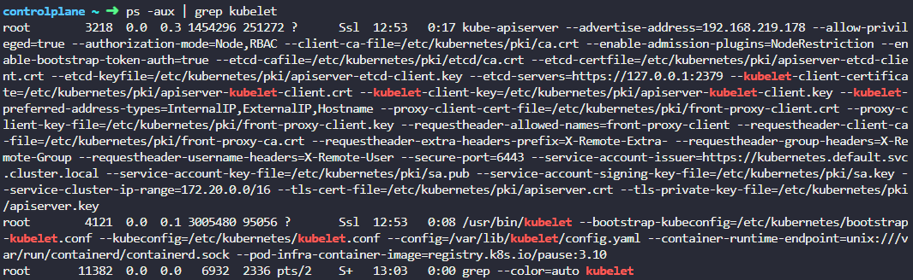
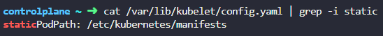

# Practice Test - Static Pods
  - Take me to [Practice Test](https://kodekloud.com/topic/practice-test-static-pods/)
  
### 풀이
Run the command ps -aux | grep kubelet and identify the config file - --config=/var/lib/kubelet/config.yaml. Then check in the config file for staticPodPath.



- 10번 (개어려움)
  - `ssh`로 node 안으로 들어가서 kubelet config 찾고 yaml 파일 삭제

Solutions to the practice test - static pods
- Run the command kubectl get pods --all-namespaces and look for those with -controlplane appended in the name
  
  <details>

  ```
  $ kubectl get pods --all-namespaces
  ```
  </details>

- Which of the below components is NOT deployed as a static pod?

  <details>

  ```
  $ kubectl get pods --all-namespaces
  ```
  </details>

- Which of the below components is NOT deployed as a static POD?

  <details>

  ```
  $ kubectl get pods --all-namespaces
  ```
  </details>

- Run the kubectl get pods --all-namespaces -o wide

  <details>

  ```
  $ kubectl get pods --all-namespaces -o wide
  ```
  </details>

- Run the command ps -aux | grep kubelet and identify the config file - --config=/var/lib/kubelet/config.yaml. Then checkin the config file for staticPdPath.

  <details>

  ```
  $ ps -aux | grep kubelet
  ```
  </details>

- Count the number of files under /etc/kubernetes/manifests

- Check the image defined in the /etc/kubernetes/manifests/kube-apiserver.yaml manifest file.

- Create a pod definition file in the manifests folder. Use command kubectl run --restart=Never --image=busybox static-busybox --dry-run -o yaml --command -- sleep 1000 > /etc/kubernetes/manifests/static-busybox.yaml
  
  <details>

  ```
  $ kubectl run --restart=Never --image=busybox static-busybox --dry-run=client -o yaml --command -- sleep 1000 > /etc/kubernetes/manifests/static-busybox.yaml
  ```
  </details>

- Simply edit the static pod definition file and save it 

  <details>

  ```
  /etc/kubernetes/manifests/static-busybox.yaml
  ```
  </details>

  OR
  
  <details>

  ```
  Run the command with updated image tag:
  kubectl run --restart=Never --image=busybox:1.28.4 static-busybox--dry-run=client -o yaml --command -- sleep 1000 > /etc/kubernetes/manifests/static-busybox.yaml
  ```
  </details>

- Identify which node the static pod is created on, ssh to the node and delete the pod definition file. If you don't know theIP of the node, run the kubectl get nodes -o wide command and identify the IP. Then SSH to the node using that IP. For static pod manifest path look at the file /var/lib/kubelet/config.yaml on node01

  <details>

  ```
  $ kubectl get pods -o wide
  $ kubectl get nodes -o wide
  $ ssh <ip address of pod>
  $ grep staticPodPath /var/lib/kubelet/config.yaml
  $ node01 $ rm -rf /etc/just-to-mess-with-you/greenbox.yaml
  ```
  </details>
