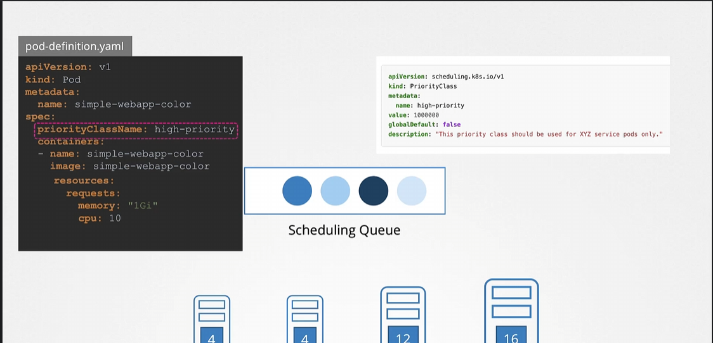
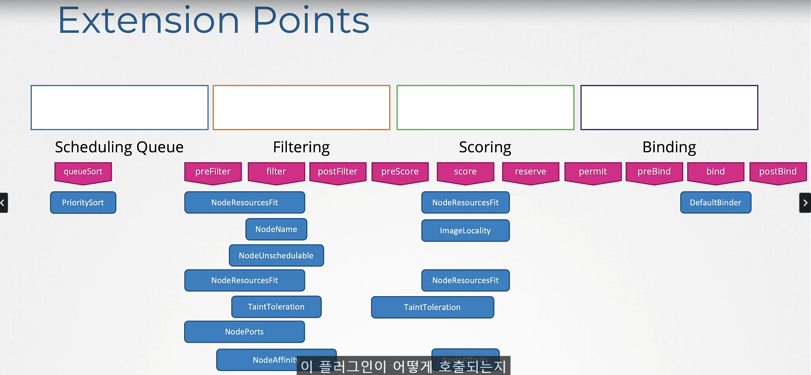
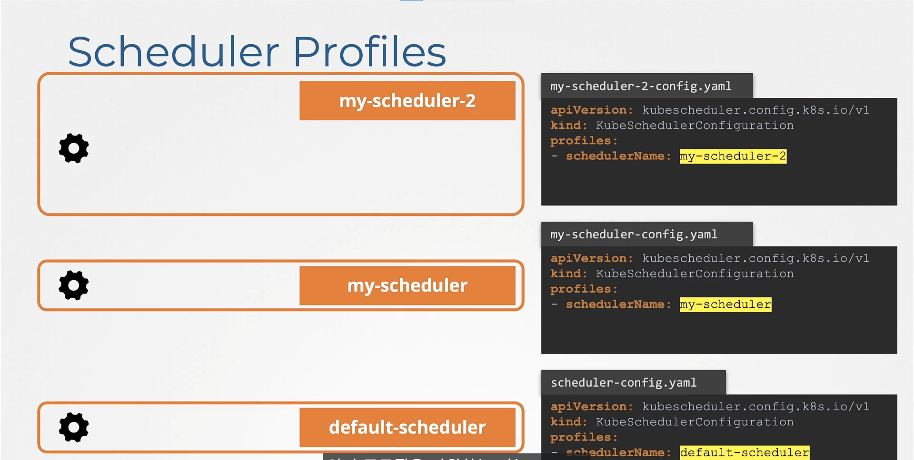
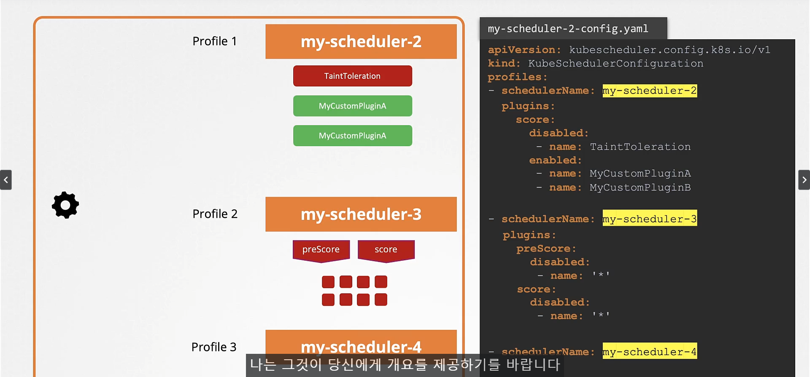

# Configuring Kubernetes Schedulers
  - Take me to [video Tutorial](https://kodekloud.com/topic/configuring-kubernetes-scheduler/)
  
In this section, we will take a look at configuring kubernetes schedulers.

### PriorityClass
- PriorityClass 를 생성하여 Pod에 우선순위 스케쥴링 가능.
  - 

### Scheduling Process
1. Schdeuling Phase
2. Flitering Phase
  - 파드가 배정될 수 있는 노드 필터링
3. Scoring Phase
  - 필터링된 노드를 기준으로 가장 점수가 높은 노드 선택
4. Binding Phase
  - 파드가 배정될 노드 선택

#### Extension and Plugin
- 파랑색 박스 : Plugin
- 빨간색 박스 : Extension
K8s에서는 플러그인이 호출되는 방식을 변경하거나 직접 플러그인을 만들어서 적용할 수 있다.

### Multi Schduler problem

여러개의 스케쥴러가 다른 프로세스에서 돌고있으면 Race Condition 발생

### Multi Profile In single Scheduler
v.1.18 부터 Race Condition을 막기 위해 하나의 스케쥴러에 여러개의 profile을 적용

## References
- https://github.com/kubernetes/community/blob/master/contributors/devel/sig-scheduling/scheduler.md
- https://kubernetes.io/blog/2017/03/advanced-scheduling-in-kubernetes/
- https://jvns.ca/blog/2017/07/27/how-does-the-kubernetes-scheduler-work/
- https://stackoverflow.com/questions/28857993/how-does-kubernetes-scheduler-work

