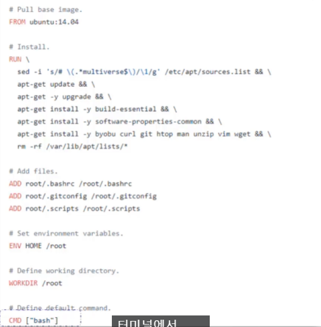
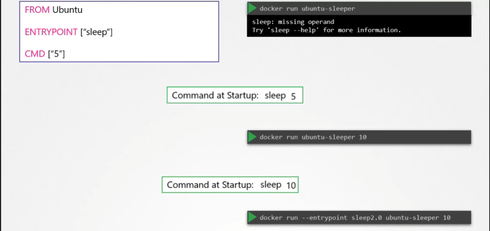

# 도커 Command, Arguement
  - [비디오 튜토리얼](https://kodekloud.com/topic/commands-and-arguments-in-docker/)로 이동하기
  
이 섹션에서는 도커의 명령어와 Argument에 대해 살펴보겠습니다.

- 도커 컨테이너를 실행하려면
  ```
  $ docker run ubuntu
  ```
- 실행 중인 컨테이너 목록을 보려면
  ```
  $ docker ps 
  ```
- 중지된 컨테이너를 포함한 모든 컨테이너 목록을 보려면
  ```
  $ docker ps -a
  ```
  
  
  
#### 가상 머신과 달리, 컨테이너는 운영 체제를 호스팅하기 위한 것이 아닙니다.
- 컨테이너는 웹 서버, 애플리케이션 서버 또는 데이터베이스 서버의 인스턴스를 호스팅하는 등 특정 작업이나 프로세스를 실행하기 위한 것입니다.
  

### Dockerfile

`CMD` 에 저장된 bash 명령을 실행하고 bash를 찾을 수 없으면 종료해버리는 것

#### 컨테이너를 시작하기 위해 다른 명령을 지정하려면 어떻게 해야 하나요?
- 한 가지 방법은 도커 실행 명령에 명령을 추가하여 이미지 내에 지정된 기본 명령을 재정의하는 것입니다.
  ```
  $ docker run ubuntu sleep 5
  ```
- 이렇게 하면 컨테이너가 시작될 때 sleep 프로그램이 실행되고, 5초 동안 대기한 후 종료됩니다. 이 변경을 영구적으로 만들려면 어떻게 해야 하나요?
  
  
  
- 명령을 지정하는 방법에는 쉘 형식으로 간단히 명령을 입력하거나 JSON 배열 형식으로 입력하는 방법이 있습니다.
 
  
  
- 이제 도커 이미지를 빌드합니다.
  ```
  $ docker build -t ubuntu-sleeper .
  ```
- 도커 컨테이너를 실행합니다.
  ```
  $ docker run ubuntu-sleeper
  ```
  
  
## Entrypoint Instruction
- `entrypoint`지시문은 `cmd` 지시문과 유사하지만 항상 맨 앞에 고정된다.
	- **커맨드 인자를 받을 수 있음**
		- `ENTRYPOINT ["sleep"]` 으로 만들고 `docker run ubuntu-sleeper 5` 으로 전달할 경우`CMD sleep 5` 와 동일하게 동작
- 이 `ENTRYPOINT` 에 기본 옵션을 주려면?
	- 아래 이미지 처럼 `CMD` 도 정의해주면 된다. 이를 `docker run` 시에 재정의 할 수 있다.
- `docker run` 시 정의된 `ENTRYPOINT` 을 덮어쓰려면?
	- `docker run --entrypoint <value> <imagename>` 로 준다.

#### K8s Reference Docs
- https://docs.docker.com/engine/reference/builder/#cmd
