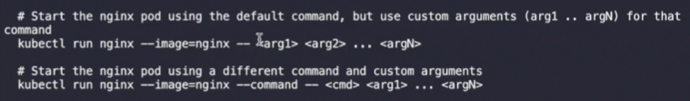

# Practice Test - Commands and Arguments
  - Take me to [Practice Test](https://kodekloud.com/topic/practice-test-commands-and-arguments/)

### 풀이
- 모든 command 는 "" (따옴표) 로 묶어줘야 한다.
- 실행중인 Pod에 대해서 Command를 변경하는 것은 불가능하다.
  - `kubectl replace --force -f <pod-definition-file>`
  - 혹은 delete 후 재생성
- `kubectl run` 시 conatiner 내부 command 전달 방법
  - 
    - ` -- ` 뒤에 오는 옵션들은 kubectl 옵션이 아닌 컨테이너 내부 command 이다.

Solutions to practice test - commands and arguments
- Run the command 'kubectl get pods' and count the number of pods.
  
  <details>
  
  ```
  $ kubectl get pods
  ```
  </details>
  
- Run the command 'kubectl describe pod' and look for command option

  <details>
  
  ```
  $ kubectl describe pod
  ```
  </details>
  
- Set the command option to ['sleep', '5000']. Answer file at: /var/answers/answer-ubuntu-sleeper-2.yaml

- Both sleep and 1200 should be defined as a string. Answer file at: /var/answers/answer-ubuntu-sleeper-3.yaml

- Answer file at: /var/answers/answer-ubuntu-sleeper-3-2.yaml

- Inspect the file 'Dockerfile' given at /root/webapp-color. What command is run at container startup?
  
  <details>
  
  ```
  python app.py
  ```
  </details>
  
- Inspect the file 'Dockerfile2' given at /root/webapp-color. What command is run at container startup?

  <details>
  ```
  python app.py --color red
  ```
  </details>
  
- The 'command' (entrypoint) is overridden in the pod definition. So the answer is --color green

- Inspect the two files under directory 'webapp-color-3'. What command is run at container startup?

  <details>
  
  ```
  python app.py --color pink
  ```
  </details>
  
- Answer file located at /var/answers/answer-webapp-color-green.yaml


