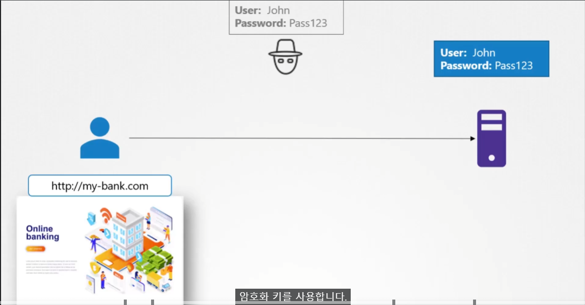

# TLS 기초
  - [비디오 튜토리얼](https://kodekloud.com/topic/tls-basics/)로 이동하기
  
이 섹션에서는 TLS 기초에 대해 살펴보겠습니다.

## 인증서
- 인증서는 거래 중 두 당사자 간의 신뢰를 보장하는 데 사용된다.
	- ex) 사용자가 웹 서버에 접근하려고 할 때, TLS 인증서는 그들 간의 통신이 암호화되도록 보장한다.

  

### 암호화를 이용하지 않으면?

Text 형식으로 보내져서 중간에 해커가 정보를 스니핑 해갈 수 있음.

## Symmetric Encryption (대칭 암호화)
- 대칭 암호화는 안전한 암호화 방법이지만, 데이터를 암호화하고 복호화하는 데 동일한 키를 사용하며, 이 키는 송신자와 수신자 간에 교환되어야 한다. 
	- 키 전달도 동일한 네트워크를 통해 전송되므로 해커가 키에 접근하여 데이터를 복호화할 위험이 있다.
  
  
## Asymmetric Encrpytion (비대칭 암호화)
단일 키를 대신, 비대칭 암호화는 Pirvate key와 Public key의 쌍을 사용한다.
- Pirvate Key는 복사가 가능하므로 Pirvate Key만 있다면 어떤 서버에서든 접속 가능.
  
- 여러개의 Public Key - Private Key pair 를 사용하여 암호화, 복호화 하는 것이 가능.
  
### 비대칭키로 대칭키 교환
1. 서버가 `openssl`을 이용하여 Public key, Private Key 생성
2. User에게 Public 키 공개 (물론 해커도 스니핑 가능)
3. User는 자신의 대칭키를 받은 서버의 Public Key 로 암호화 후 전달
4. Server는 자신의 Public Key로 암호화된 User의 대칭키를 Private Key로 복호화
5. 대칭키 교환 완료

> [!NOTE] 해커는?
> 
**해커가 네트워크에서 가져갈 수 있는건 서버의 Public Key와 이로 암호화된 대칭키.**
-> 네트워크 간 서버의 Private key가 전달되지 않았기 때문에 해커가 위 2개를 가지고 있어도 할 수 있는 것이 없음.

   

#### 그런데 대칭키가 해커에게 넘어가버리면?
해커가 원래 쓰던 사이트와 매우 똑같은 사이트를 만들고 거기서 키 교환 및 데이터 전달을 한다면 
-> 해킹당함.
  
  

#### Certificate를 어떻게 확인하고 그것이 합법적인지 검증하는가?
- 인증서를 서명하고 발급한 사람.
- 인증서를 생성하면 스스로 서명해야 하며, 이를 자기 서명 인증서(self-signed certificate)라고 한다.
- 통신 과정에서 이 Certificate 가 유효한지 **웹 브라우저**가 판단한다.

  
  
#### 합법적인 인증서 생성
여기서 **`Certificate Authority (CA)`가 필요하다.
유명한 CA로는 Symantec, DigiCert, Comodo, GlobalSign 등이 있다.  

  
  > [!NOTE] CA 인증서 발급
> 브라우저에는 CA 들의 공개키가 저장되어 있음.
> -> CA가 그들의 Private Key 로 암호화하여 Certificate 를 발급하면 브라우저가 복호화하고 검증할 수 있다.
  
  
## 공개 키 인프라스트럭처
   
   
   
## 인증서 명명 규칙
- Public Key
	- `.crt`
	- `.pem`
- Private Key
	- `.key`
	- `-key.pem`

  
