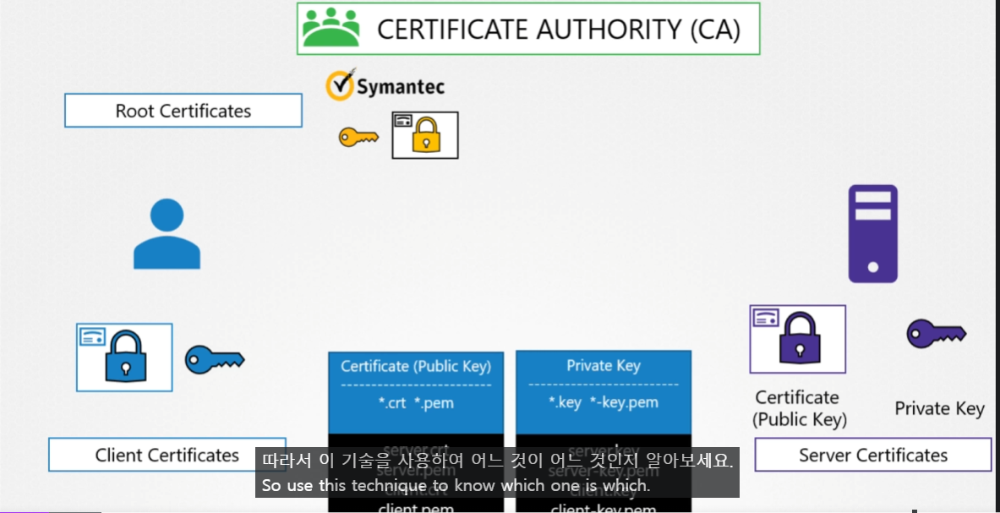
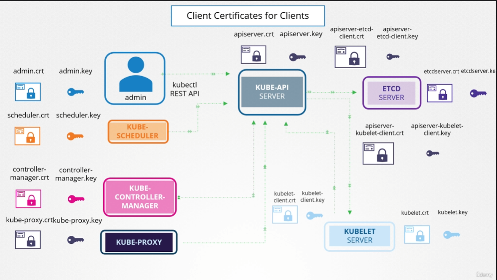

# Kubernetes에서의 TLS
  - [비디오 튜토리얼](https://kodekloud.com/topic/tls-in-kubernetes/)로 이동하기
  
이 섹션에서는 Kubernetes에서의 TLS를 살펴본다.

#### 두 가지 주요 요구 사항은 클러스터 내의 모든 다양한 서비스가 서버 인증서(server certificates)를 사용하고 모든 클라이언트가 클라이언트 인증서(client certificates)를 사용하여 자신이 주장하는 대로의 신원을 확인하는 것이다.
- 서버를 위한 서버 인증서
- 클라이언트를 위한 클라이언트 인증서

  
  
#### Server, Client

#### **Client**
- Kube-api Server 아래의 Client
	- Admin (User)
	- Kube-schduler
	- kube-controller-manager
	- kube-proxy
- kube-api 가 Client 가 될때
- kubelet이 client가 될때

#### 요청을 수용하는 Server
- kube-api-server
- etcd-server
- kubelet-server
 

