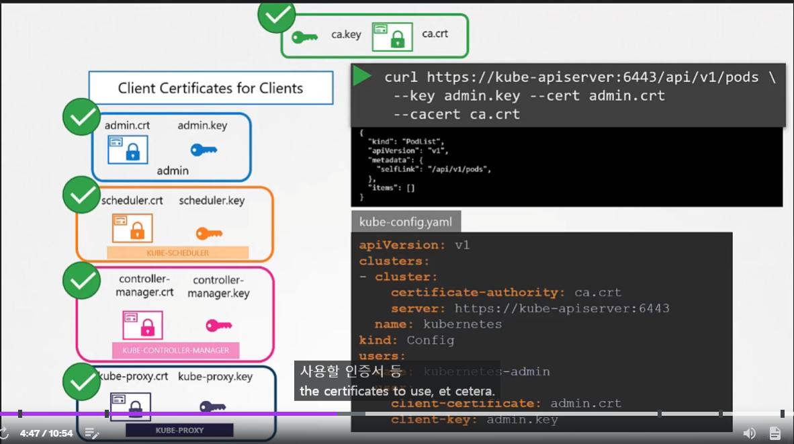

# Kubernetes에서의 TLS - 인증서 생성
  - [비디오 튜토리얼](https://kodekloud.com/topic/tls-in-kubernetes-certificate-creation/)로 이동하기
  
이 섹션에서는 Kubernetes에서 TLS 인증서 생성에 대해 살펴본다.

## 인증서 생성
- easyrsa, openssl, cfssl 등 다양한 도구를 사용하여 인증서를 생성할 수 있다.

## 인증 기관 (CA)

- 키 생성
  ```
  $ openssl genrsa -out ca.key 2048
  ```
- CSR 생성
  ```
  $ openssl req -new -key ca.key -subj "/CN=KUBERNETES-CA" -out ca.csr
  ```
- 인증서 서명
  ```
  $ openssl x509 -req -in ca.csr -signkey ca.key -out ca.crt
  ```
 
 
 
## 클라이언트 인증서 생성

#### 관리자 사용자 인증서

- 키 생성
  ```
  $ openssl genrsa -out admin.key 2048
  ```
- CSR 생성
	-  `/CN=kube-admin` : 통신할 때 사용할 이름 (꼭 kube-admin 이 아니어도 됨)
  ```
  $ openssl req -new -key admin.key -subj "/CN=kube-admin" -out admin.csr
  ```
- 인증서 서명
  ```
  $ openssl x509 -req -in admin.csr -CA ca.crt -CAkey ca.key -out admin.crt
  ```
  
  
  
- 관리자 권한이 있는 인증서
	- `/O=system:masters` : `system:masters` 라는 그룹(관리자) 권한 부여
  ```
  $ openssl req -new -key admin.key -subj "/CN=kube-admin/O=system:masters" -out admin.csr
  ```
  
#### kube-apiserver에 접근하는 다른 모든 구성 요소에 대해 클라이언트 인증서를 생성하는 동일한 절차를 따른다.
- kube-schdueler
- kube-controller-manager
- kube-proxy
  
  
  
  
  
   
  
### 키 활용 방법

웹 브라우저가 CA와 인증절차를 대신해주지만
k8s 클러스터 안에서는 CA Root Certificate 가 필요하다.
- API 요청 할 때 인자로 전달
- `kube-config.yaml` 저장


## 서버 인증서 생성

### ETCD 서버 인증서


여러개의 ETCD Server 가 있는 고가용성 구조에서는 ETCD 서버 사이의 추가적인 peer-cerfificate 생성 필요.
  
### Kube-apiserver 인증서

- kube-api-server는 많은 곳에서 접근되고 많은 alias 들이 있음.
	- kubernetes
	- kubernetes.default
	- kubernetes.default.svc
	- kubernetes.default.svc.cluster.local
	- 10.96.0.01
-> 이를 사용하기 위해서는 인증서를 만들 때 config 파일로 따로 정의해서 같이 넘겨줘야 한다.

- etcd 의 client
- kubelet의 client
- server 키 페어

### Kubectl 노드 (서버 인증서)


kubelet 인증서는 kubelet이 **위치한 노드의 이름** 을 가진다.
ex) node01, node02

### Kubectl 노드 (클라이언트 인증서)


**system:node:<node 이름>**