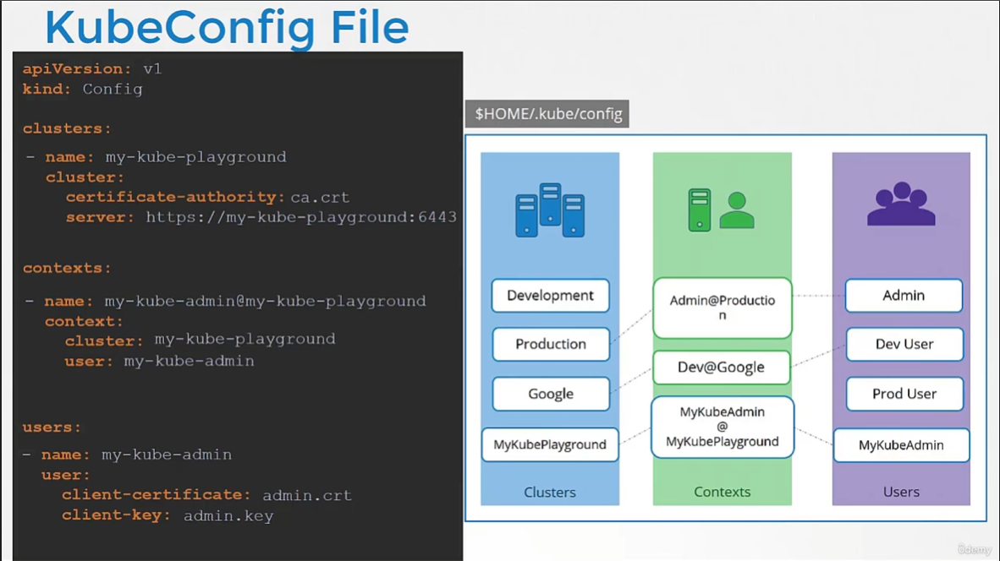

# KubeConfig 
  - [비디오 튜토리얼](https://kodekloud.com/topic/kubeconfig/)로 이동하기

이 섹션에서는 Kubernetes에서 kubeconfig에 대해 살펴본다.

#### 클라이언트는 인증서 파일과 키를 사용하여 Kubernetes Rest API에 쿼리하여 pod 목록을 가져온다(curl 사용).
- 동일한 작업을 kubectl을 사용하여 수행할 수 있다. (일반적으로 사용자들은 이 옵션 사용)
	- 그러나 이 `kubectl` 을 사용할 때마다 인증을 위해 key들을 함께 보내줘야 한다.
  
- 이 정보를 kubeconfig라는 구성 파일로 이동할 수 있다. 그리고 이 파일을 명령의 kubeconfig 옵션으로 지정한다.
- 기본값 : `$home/.kube/config` 아래에 파일이 있으면 따로 옵션을 주지 않아도 됨.
  ```
  $ kubectl get pods --kubeconfig config
  ```
  
## Kubeconfig 파일
- kubeconfig 파일은 3개의 섹션으로 구성된다.
  - Clusters
  - Contexts : `Cluster` + `@` +`User` 합친 값
  - Users
  
### Config 예시

  - Cluster : MyKubePlayground 
  - User : MyKubeAdmin
  -> Context : MyKubeAdmin@MyKubePlayground 
  
  
`current-context` 를 통해 default context 명시

- 현재 사용 중인 파일을 보려면
  ```
  $ kubectl config view
  ```
- "--kubeconfig" 플래그와 함께 kubectl config view로 kubeconfig 파일을 지정할 수 있다.
  ```
  $ kubectl config view --kubeconfig=my-custom-config
  ```
  
  
  
- 현재 컨텍스트를 업데이트하거나 변경하려면
	- use-context를 사용하면 실제 파일 내용도 변경
```
$ kubectl config use-context <context-name>
예: 
$ kubectl config use-context prod-user@production
```
  
  
  
- kubectl config 도움말
  ```
  $ kubectl config -h
  ```
  
  
  
## 네임스페이스는 어떻게 되나?

  
 context에 `namespace` 항목을 저장하게 되면 그 context 으로 전환 시 namespace 도 자동 전환
## kubeconfig의 인증서
1. `certificate-authority`  `.crt`, `.key` 파일명 yaml 파일에 작성
2.  `certificate-authority-data` 에 base64로 인코딩 된 텍스트 작성
  
 파일 이름만 적는거 보다 전체 파일 경로를 적는 것이 나음.
  
  
 파일이름을 넣는 대신 base64로 인코딩된 키 텍스트를 직접 `certificate-authority-data`에 넣어도 됨.
#### K8s 참조 문서
- https://kubernetes.io/docs/tasks/access-application-cluster/configure-access-multiple-clusters/
- https://kubernetes.io/docs/reference/generated/kubectl/kubectl-commands#config
