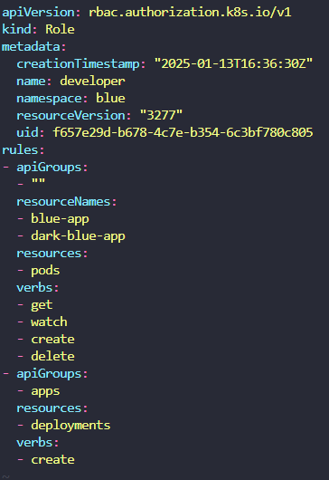

# Practice Test - RBAC
  - Take me to [Practice Test](https://kodekloud.com/topic/practice-test-role-based-access-controls/)

### 풀이
-  role 과 rolebinding이 다른 것에 유의
	- `kubectl get role` 
	- `kubectl get rolebinding`

- 권한 확인
	- `kubectl auth can-i get pods --as dev-user`


[role 생성](https://kubernetes.io/docs/reference/access-authn-authz/rbac/#kubectl-create-rolebinding)

- rule 설정 시 apiGroup 이 다를 경우 하나의 덩어리를 새로 만들어줘야 함.
	

> [!Important] namspace
> role은 `namespace` 범위에 속하므로 role 을 수정하거나 검색할때는 `-n <namespace>` 옵션을 꼭 붙여야함.


Solutions to practice test - RBAC
- Run the command kubectl describe pod kube-apiserver-controlplane -n kube-system and look for --authorization-mode
  
  <details>
  
  ```
  $ kubectl describe pod kube-apiserver-controlplane -n kube-system
  ```
  
  </details>
  
- Run the command kubectl get roles

  <details>
  
  ```
  $ kubectl get roles
  ```
  
  </details>
  
- Run the command kubectl get roles --all-namespaces
  
  <details>
  
  ```
  $ kubectl get roles --all-namespaces
  ```
  
  </details>
  
- Run the command kubectl describe role kube-proxy -n kube-system
  
  <details>
  
  ```
  $ kubectl describe role kube-proxy -n kube-system
  ```
  
  </details>
  
- Check the verbs associated to the kube-proxy role
  
  <details>
  ```
  $ kubectl describe role kube-proxy -n kube-system
  ```
  </details>
  
- Which of the following statements are true?
  
  <details>
  ```
  kube-proxy role can get details of configmap object by the name kube-proxy
  ```
  </details>
  
- Run the command kubectl describe rolebinding kube-proxy -n kube-system
  
  <details>
  ```
  $ kubectl describe rolebinding kube-proxy -n kube-system
  ```
  </details>
  
- Run the command kubectl get pods --as dev-user
  
  <details>
  ```
  $ kubectl get pods --as dev-user
  ```
  </details>
  
- Answer file located at /var/answers
  
  <details>
  
  ```
  $ kubectl create -f /var/answers/developer-role.yaml
  ```
  
  </details>
  
- New roles and role bindings are created in the blue namespace. Check it out. Check the resourceNames configured on the role
  
  <details>
  
  ```
  $ kubectl get roles,rolebindings -n blue
  $ kubectl describe role developer -n blue
  $ kubectl edit role developer -n blue (update the resourceNames)
  ```
  
  </details>
  
- View the answer file located at /var/answers/dev-user-deploy.yaml
  
  <details>
  
  ```
  $ kubectl create -f /var/answers/dev-user-deploy.yaml
  ```
  
  </details>
