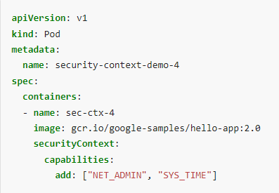

# Practice Test - Security Context
  - Take me to [Practice Test](https://kodekloud.com/topic/practice-test-security-contexts/)

### 풀이
- `whoami` : 현재 user 가 무엇인지 확인
- `kubectl delete pod ubuntu-sleeper --force` : 바로 POD 삭제 (빠르게)
- **POD 설정 보다 Container 설정이 우선**
- Container 설정 아래 `spec.securityContext.capabilities.add`
	- 컨테이너 옵션으로만 줄 수 있고 POD 단위에선 안됨
	- 

Solutions to practice test - security context
- Run the command 'kubectl exec ubuntu-sleeper whoami' and count the number of pods.

  <details>
  
  ```
  $ kubectl exec ubuntu-sleeper whoami
  ```
  
  </details>
  
- Set a security context to run as user 1010.

  <details>
  
  ```
  $ kubectl get pods ubuntu-sleeper -o yaml > ubuntu.yaml
  $ kubectl delete pod ubuntu-sleeper
  $ vi ubuntu.yaml ( add securityContext Section)
    securityContext:
      runAsUser: 1010
  $ kubectl create -f ubuntu.yaml
  ```
  
  </details>
  
- The User ID defined in the securityContext of the container overrides the User ID in the POD.
 
- The User ID defined in the securityContext of the POD is carried over to all the PODs in the container.

- Run kubectl exec -it ubuntu-sleeper -- date -s '19 APR 2012 11:14:00'
  
  <details>
  
  ```
  $ kubectl exec -it ubuntu-sleeper -- date -s '19 APR 2012 11:14:00'
  ```
  
  </details>
  
- Add SYS_TIME capability to the container's securityContext
  
  <details>
  
  ```
  $ kubectl get pods ubuntu-sleeper -o yaml > ubuntu.yaml
  $ kubectl delete pod ubuntu-sleeper
  $ vi ubuntu.yaml
  
  Under container section add the below
  
  securityContext:
      capabilities:
        add: ["SYS_TIME"]
        
  $ kubectl create -f ubuntu.yaml
  ```
  
  </details>
  
 - Now try to run the below command in the pod to set the date. If the security capability was added correctly, it should work. If it doesn't make sure you changed the user back to root.
  
   <details>
  
   ```
   $ kubectl exec -it ubuntu-sleeper -- date -s '19 APR 2012 11:14:00'
   ```
  
   </details>
   
