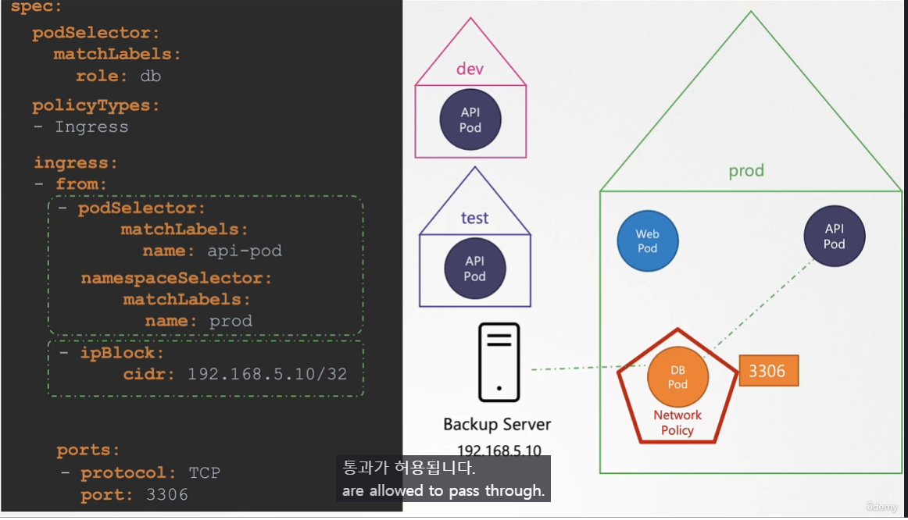
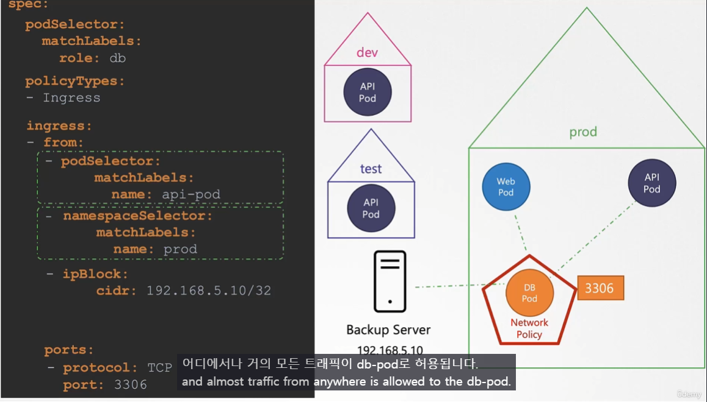

# Network Policies
  - [비디오 튜토리얼](https://kodekloud.com/topic/network-policies-3/)로 이동

> [!example]
> 웹 서버에서 사용자에게 프론트엔드를 제공하고, 앱 서버에서 백엔드 API를 제공하며, 데이터베이스 서버로 흐르는 트래픽  


  
- 트래픽 두 가지 유형
  - **Ingress** : 서버로 들어오는 요청
  - **Egress** : 서버에서 나가는 요청
   
  - 앱 서버의 Egress == API 서버의 Ingress
	  - **주체가 누군지에 따라 같은 요청임에도 해석이 달라질 수 있다.**
   
## Network Security
  
  쿠버네티스는 default 로 다른 포트에 대한 모든 Network 허용 규칙
## Network Policy
> [!important]
> - **POD 단위에서만 적용 가능**
> - `NetworkPolicy` 객체에 따로 정의하지 않으면 **모두 허용**
>   - NetworkPolicy 객체에 Ingress 관련한 내용만 정의할 경우, Egress 는 default 값에 따라 모두 허용됨.


  
  다른 POD의 접근을 막고 싶다면? (ex. 웹서버의 DB 서버로의 직접 접근 권한 제거)
  

## Network Policy Selectors
  
  
## Network Policy Rules
  
  
## 네트워크 정책 생성
 
- Network Policy을 생성하려면
  ```
  apiVersion: networking.k8s.io/v1
  kind: NetworkPolicy
  metadata:
   name: db-policy
  spec:
    podSelector:
      matchLabels:
        role: db
    policyTypes:
    - Ingress
    ingress:
    - from:
      - podSelector:
          matchLabels:
            role: api-pod
      ports:
      - protocol: TCP
        port: 3306
  ```
  위 객체의 경우 Egress 는 모두 허용된 상태임을 유의.
  ```
  $ kubectl create -f policy-definition.yaml
  ```
  

 
 
  
## 주의 사항
 
 NetworkPolicy를 지원하지 않는 네트워크 솔루션이 있음.
 - 이 경우 `NetworkPolicy` 정의는 가능하나 적용이 안됨.
	 - 심지어 오류 Log 도 발생하지 않으므로 이에 유의.

### 조건 걸 때 유의 사항

- `spec.ingress.from` 아래 **`-` 에 따라 조건의 단위가 결정된다.**
	- `-` 안에서는 AND
	- `-` 마다는 OR

위 케이스에서는 podSelector의 조건을 만족하며 namespaceSelector의 조건이 한 Block 이 므로 두 조건을 모두(`AND`) 만족해야지 ingress traffic이 허용된다.


여기서는 당연히 `-` 가 조건마다 하나씩 박혀있기 때문에 두 조건은 OR로 연결된다.

#### [네트워킹 정책 개발](https://kodekloud.com/topic/developing-network-policies/)에 대한 추가 강의
#### K8s 참조 문서
- https://kubernetes.io/docs/concepts/services-networking/network-policies/
- https://kubernetes.io/docs/tasks/administer-cluster/declare-network-policy/
