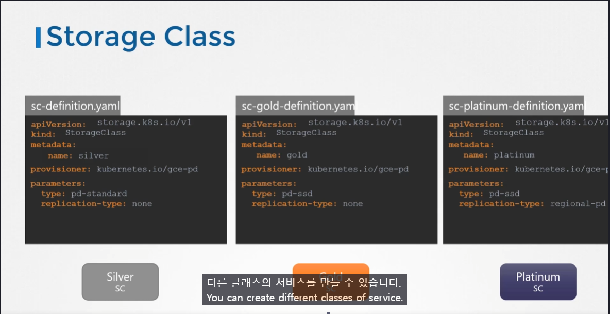

# Storage Class
  - [강의](https://kodekloud.com/topic/storage-class/)로 이동하기

이 섹션에서는 **Storage Class**에 대해 살펴본다.

- Persistent Volume과 Persistent Volume Claim을 생성하는 방법에 대해 논의하였고, Pod의 볼륨을 사용하여 해당 볼륨 공간을 요청하는 방법도 살펴보았다.
- Persistent Volume을 생성하였지만, GCP, AWS, Azure와 같은 클라우드 제공업체에서 볼륨을 가져오는 경우, 먼저 Google Cloud에서 디스크를 생성해야 한다.
- Pod 정의 파일에서 정의할 때마다 수동으로 생성해야 하며, 이를 **Static Provisioning**(정적 프로비저닝)이라고 한다.
#### Static Provisioning


#### Dynamic Provisioning

- Storage Class가 생성될 때 자동으로 Persistent Volume이 생성된다. 이를 **Dynamic Provisioning**(동적 프로비저닝)이라고 한다.
	- 이제 Storage Class가 있으므로 Persistent Volume을 더 이상 정의할 필요가 없다. 
```
sc-definition.yaml

apiVersion: storage.k8s.io/v1
kind: StorageClass
metadata:
   name: google-storage
provisioner: kubernetes.io/gce-pd
```

#### parameter

Stroage Class에 파라미터 정의 가능. (Provisioner 마다 다를 수 있음,.)

#### Create a Storage Class
```
$ kubectl create -f sc-definition.yaml
storageclass.storage.k8s.io/google-storage created
```

#### List the Storage Class
```
$ kubectl get sc
NAME             PROVISIONER            RECLAIMPOLICY   VOLUMEBINDINGMODE   ALLOWVOLUMEEXPANSION   AGE
google-storage   kubernetes.io/gce-pd   Delete          Immediate           false                  20s
```

#### Create a Persistent Volume Claim
```
pvc-definition.yaml

kind: PersistentVolumeClaim
apiVersion: v1
metadata:
  name: myclaim
spec:
  accessModes: [ "ReadWriteOnce" ]
  storageClassName: google-storage       
  resources:
   requests:
     storage: 500Mi
```
```
$ kubectl create -f pvc-definition.yaml

```
#### Create a Pod
```
pod-definition.yaml

apiVersion: v1
kind: Pod
metadata:
  name: mypod
spec:
  containers:
    - name: frontend
      image: nginx
      volumeMounts:
      - mountPath: "/var/www/html"
        name: web
  volumes:
    - name: web
      persistentVolumeClaim:
        claimName: myclaim
```
```
$ kubectl create -f pod-definition.yaml
```
#### Provisioner


#### Kubernetes Storage Class Reference Docs
- https://kubernetes.io/docs/concepts/storage/storage-classes/
- https://cloud.google.com/kubernetes-engine/docs/concepts/persistent-volumes#storageclasses
- https://docs.aws.amazon.com/eks/latest/userguide/storage-classes.html
