# Pre-requisite Network Namespaces
  - Take me to [Lecture](https://kodekloud.com/topic/prerequsite-network-namespaces/)

In this section, we will take a look at **Network Namespaces**


## Process Namespace
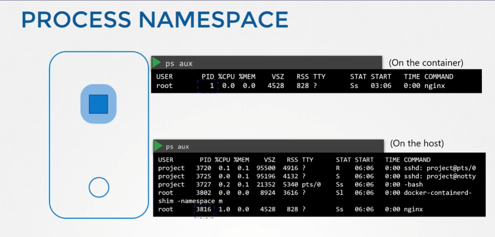
`namespace`로 격리된 프로세스 안에서는 자기가 `root` 프로세스 인 것처럼 보이지만
진짜 host 에서 바라보면 하나의 프로세스 일 뿐이다.

> On the container
```
$ ps aux      
```

> On the host
```
$ ps aux 
```

## Network Namespace
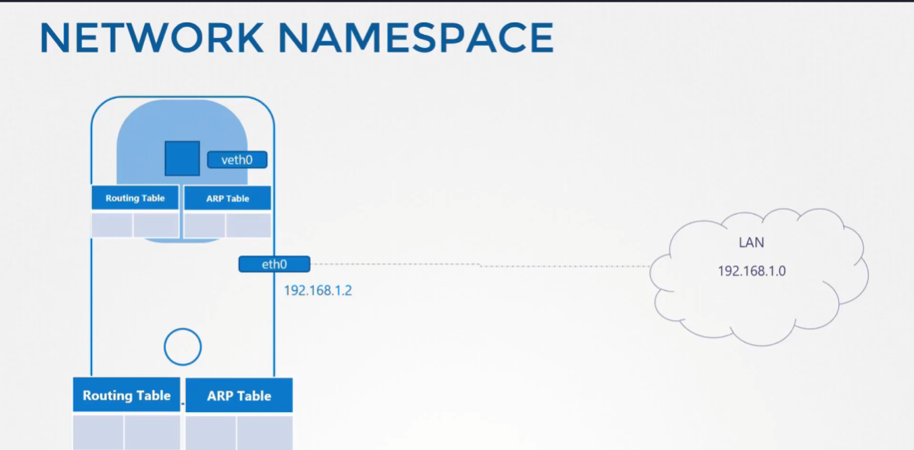
- 컨테이너가 프로세스 상에서 격리된 것 처럼 `Network Namespace` 또한 가진다.
	- **컨테이너 안에 Routing Table 과 ARP Table 을 따로 가진다.**

```
$ route
```

```
$ arp
```

## Create Network Namespace
```
$ ip netns add red

$ ip netns add blue
```
- List the network namespace

```
$ ip netns
```

## Exec in Network Namespace
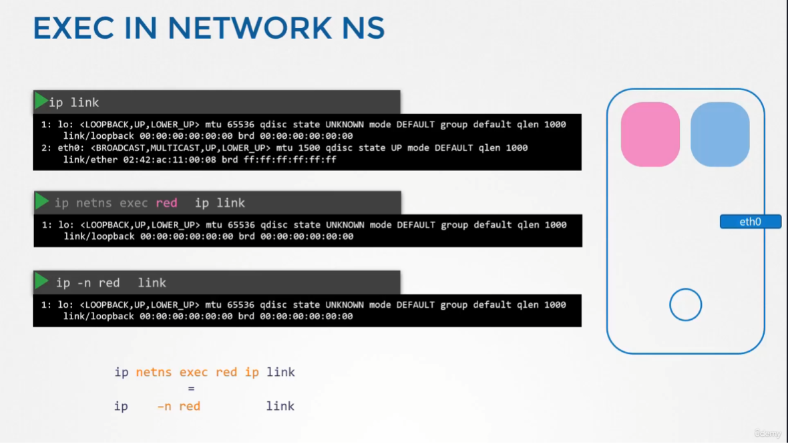
- List the interfaces on the host
```
$ ip link
```

- Exec inside the network namespace
	- 방법1) `ip link` 명령어 앞에 `ip netns exec <netns_name>` 붙임
	- 방법2) `ip -n <netns_name> link`
```
$ ip netns exec red ip link
1: lo: <LOOPBACK> mtu 65536 qdisc noop state DOWN mode DEFAULT group default qlen 1000
    link/loopback 00:00:00:00:00:00 brd 00:00:00:00:00:00

$ ip netns exec blue ip link
1: lo: <LOOPBACK> mtu 65536 qdisc noop state DOWN mode DEFAULT group default qlen 1000
    link/loopback 00:00:00:00:00:00 brd 00:00:00:00:00:00
```
- You can try with other options as well. Both works the same.
```
$ ip -n red link
1: lo: <LOOPBACK> mtu 65536 qdisc noop state DOWN mode DEFAULT group default qlen 1000
    link/loopback 00:00:00:00:00:00 brd 00:00:00:00:00:00
```

## ARP and Routing Table
> On the host
```
$ arp
Address                  HWtype  HWaddress           Flags Mask            Iface
172.17.0.21              ether   02:42:ac:11:00:15   C                     ens3
172.17.0.55              ether   02:42:ac:11:00:37   C                     ens3
```

> On the Network Namespace
```
$ ip netns exec red arp
Address                  HWtype  HWaddress           Flags Mask            Iface

$ ip netns exec blue arp
Address                  HWtype  HWaddress           Flags Mask            Iface
```

> On the host 
```
$ route
```

> On the Network Namespace
```
$ ip netns exec red route
Kernel IP routing table
Destination     Gateway         Genmask         Flags Metric Ref    Use Iface

$ ip netns exec blue route
Kernel IP routing table
Destination     Gateway         Genmask         Flags Metric Ref    Use Iface
```

## Virtual Cable
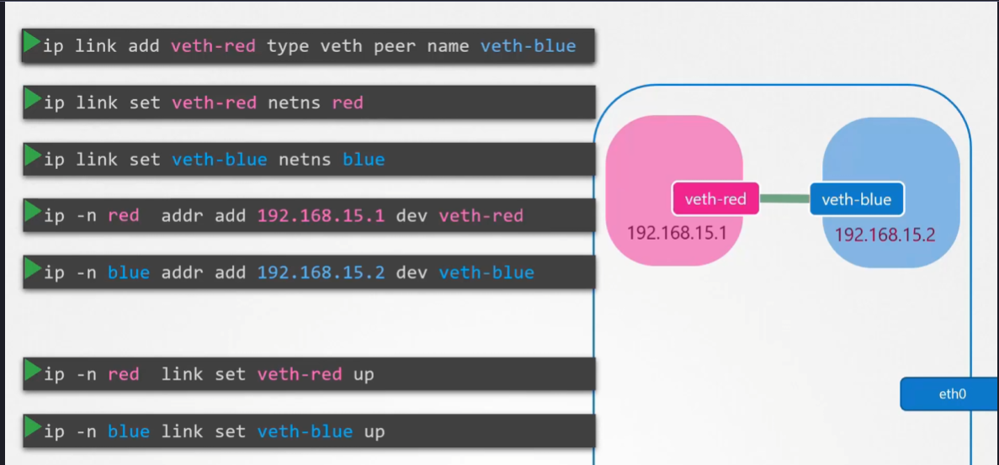
- To create a virtual cable
```
$ ip link add veth-red type veth peer name veth-blue
```

- To attach with the network namespaces
```
$ ip link set veth-red netns red

$ ip link set veth-blue netns blue
```

- To add an IP address
```
$ ip -n red addr add 192.168.15.1/24 dev veth-red

$ ip -n blue addr add 192.168.15.2/24 dev veth-blue
```

- To turn it up `ns` interfaces
```
$ ip -n red link set veth-red up

$ ip -n blue link set veth-blue up
```

- Check the reachability 
```
$ ip netns exec red ping 192.168.15.2
PING 192.168.15.2 (192.168.15.2) 56(84) bytes of data.
64 bytes from 192.168.15.2: icmp_seq=1 ttl=64 time=0.035 ms
64 bytes from 192.168.15.2: icmp_seq=2 ttl=64 time=0.046 ms

$ ip netns exec red arp
Address                  HWtype  HWaddress           Flags Mask            Iface
192.168.15.2             ether   da:a7:29:c4:5a:45   C                     veth-red

$ ip netns exec blue arp
Address                  HWtype  HWaddress           Flags Mask            Iface
192.168.15.1             ether   92:d1:52:38:c8:bc   C                     veth-blue

```
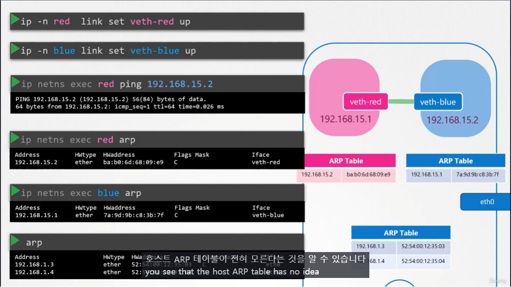
Host의 ARP 테이블에서는 이 연결에 대한 정보를 전혀 모른다.

- Delete the link.
```
$ ip -n red link del veth-red
```

> On the host
```
# Not available
$ arp
Address                  HWtype  HWaddress           Flags Mask            Iface
172.16.0.72              ether   06:fe:61:1a:75:47   C                     ens3
172.17.0.68              ether   02:42:ac:11:00:44   C                     ens3
172.17.0.74              ether   02:42:ac:11:00:4a   C                     ens3
172.17.0.75              ether   02:42:ac:11:00:4b   C                     ens3
```

## Linux Bridge
**Switch 역할을 하는 개체**

- Create a network namespace
```
$ ip netns add red

$ ip netns add blue
``` 
- To create a internal virtual bridge network, we add a new interface to the host
```
$ ip link add v-net-0 type bridge
```
- Display in the host
```
$ ip link
8: v-net-0: <BROADCAST,MULTICAST> mtu 1500 qdisc noop state DOWN mode DEFAULT group default qlen 1000
    link/ether fa:fd:d4:9b:33:66 brd ff:ff:ff:ff:ff:ff
```
- Currently it's down, so turn it up
```
$ ip link set dev v-net-0 up
```
- To connect network namespace to the bridge. Creating a virtual cabel
```
$ ip link add veth-red type veth peer name veth-red-br

$ ip link add veth-blue type veth peer name veth-blue-br
```
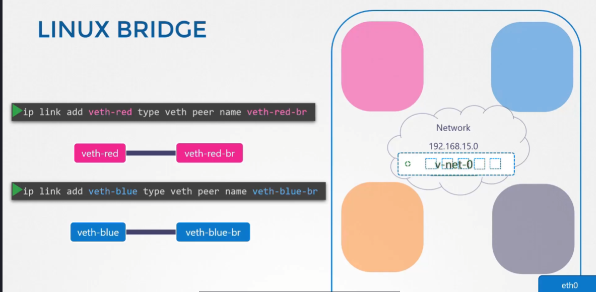

- Set with the network namespaces
```
$ ip link set veth-red netns red

$ ip link set veth-blue netns blue

$ ip link set veth-red-br master v-net-0

$ ip link set veth-blue-br master v-net-0
```
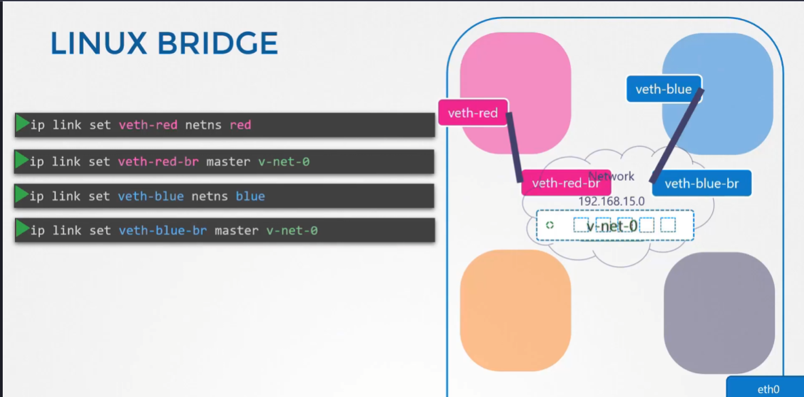

- To add an IP address
```
$ ip -n red addr add 192.168.15.1/24 dev veth-red

$ ip -n blue addr add 192.168.15.2/24 dev veth-blue
```
- To turn it up `ns` interfaces
```
$ ip -n red link set veth-red up

$ ip -n blue link set veth-blue up
```
- To add an IP address
```
$ ip addr add 192.168.15.5/24 dev v-net-0
```
- Turn it up added interfaces on the host
```
$ ip link set dev veth-red-br up
$ ip link set dev veth-blue-br up
```
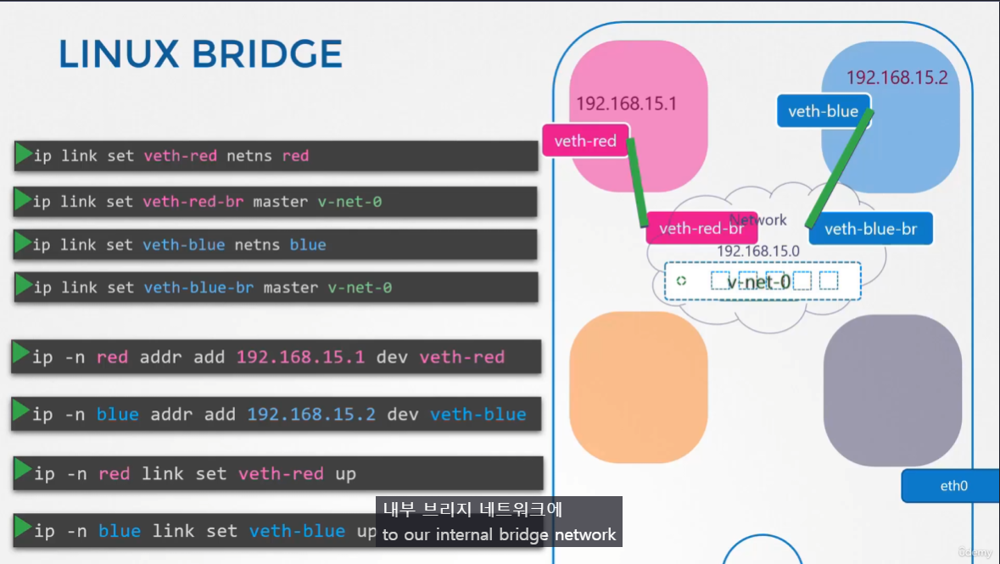


> On the host
```
$ ping 192.168.15.1
```

> On the ns
```
$ ip netns exec blue ping 192.168.1.1
Connect: Network is unreachable
```

#### Linux Bridge IP 주소 부여
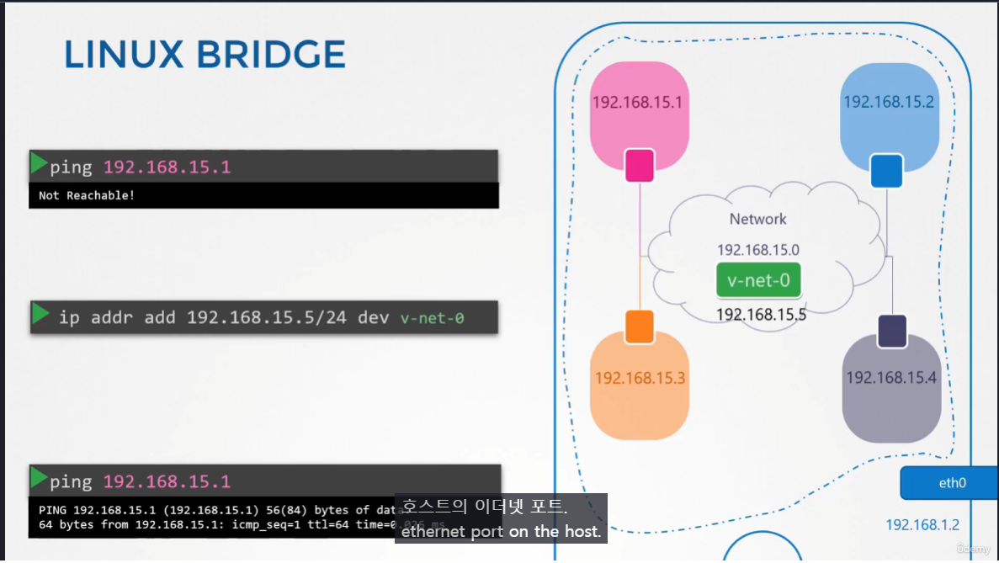
> [!note]
> Linux Bridge 도 하나의 네트워크 객체이기 때문에 ip를 부여해줘야지 정상적으로 사용 가능.

### Private Network Namespace 에서 Host외부로 접근
#### Linux Bride 를 Gateway로 추가
```
$ ip netns exec blue route

$ ip netns exec blue ip route add 192.168.1.0/24 via 192.168.15.5
```
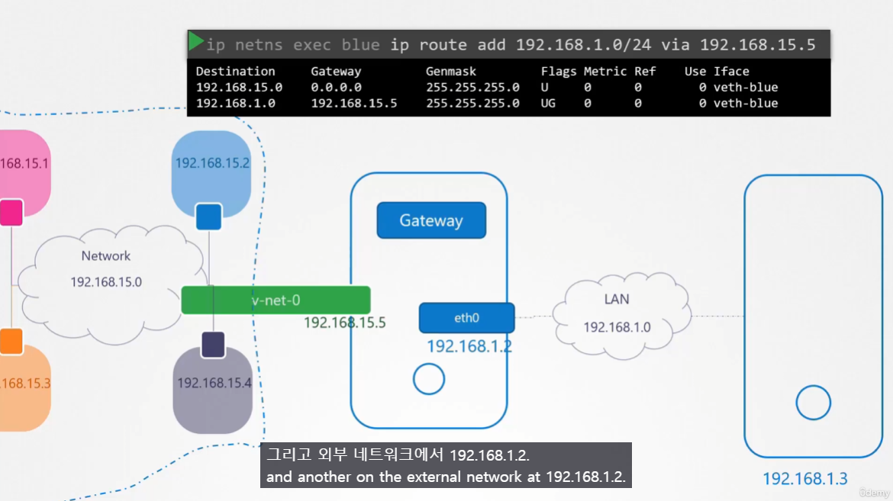

#### NAT table 추가
```
# Check the IP Address of the host
$ ip a

$ ip netns exec blue ping 192.168.1.1
PING 192.168.1.1 (192.168.1.1) 56(84) bytes of data.
```

```
$ iptables -t nat -A POSTROUTING -s 192.168.15.0/24 -j MASQUERADE
```
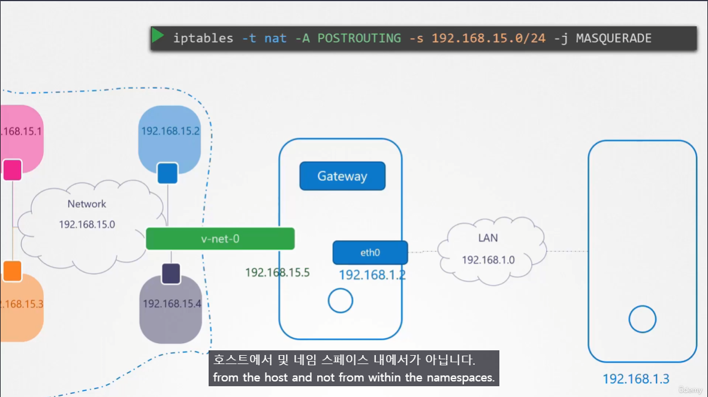
**Private IP 를 외부에서 알지 못하기 때문에 `iptables` 옵션으로 NAT table을 추가해야 한다.**

### Private Network Namespace 에서 인터넷으로 접근
```
$ ip netns exec blue ping 192.168.1.1

$ ip netns exec blue ping 8.8.8.8

$ ip netns exec blue route

$ ip netns exec blue ip route add default via 192.168.15.5

$ ip netns exec blue ping 8.8.8.8
```
deafult 게이트웨이 추가?


### 외부에서 Private Namespace 로 접근
- Adding port forwarding rule to the iptables
```
$ iptables -t nat -A PREROUTING --dport 80 --to-destination 192.168.15.2:80 -j DNAT
```
```
$ iptables -nvL -t nat
```


