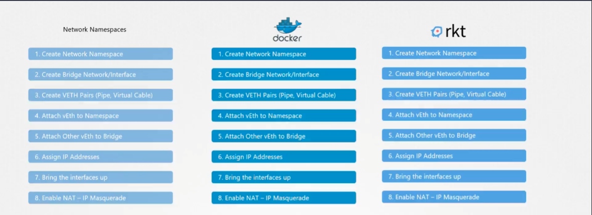
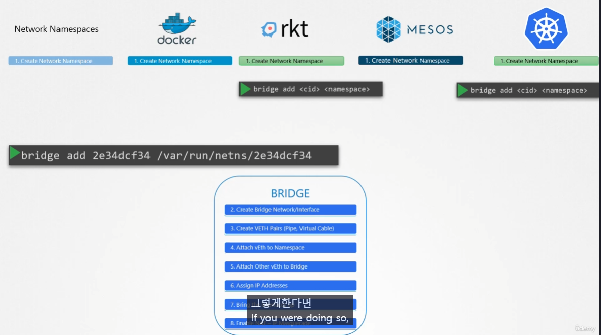
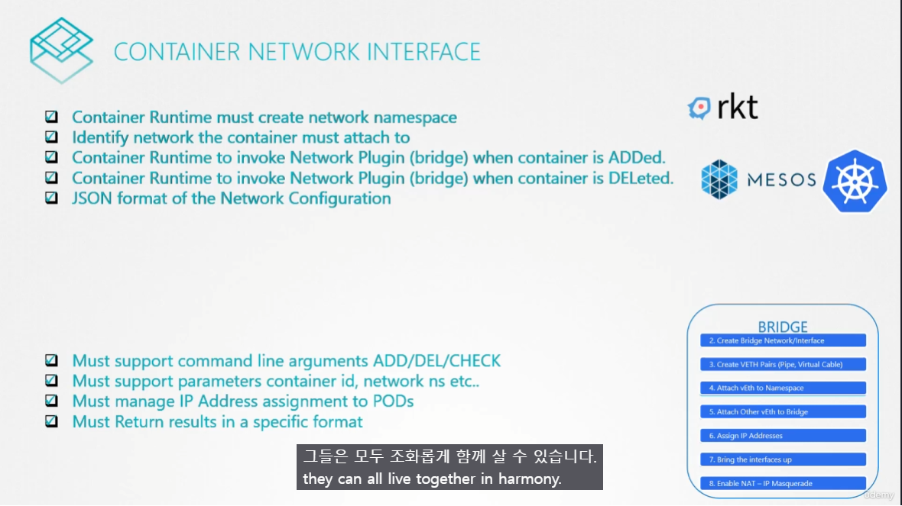
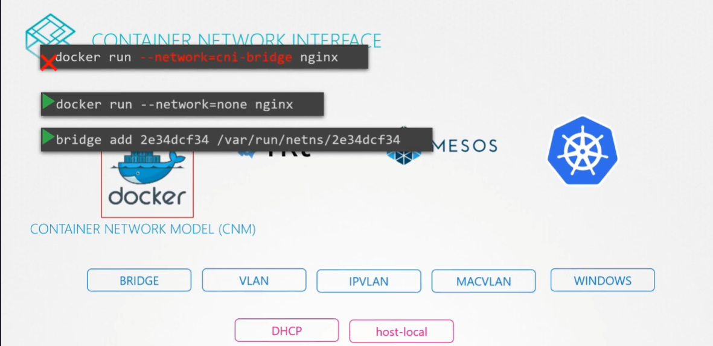

# Pre-requisite CNI
  - Take me to [Lecture](https://kodekloud.com/topic/prerequsite-cni/)

In this section, we will take a look at **Pre-requisite Container Network Interface(CNI)**

### 리눅스 기술과 Container runtime 비교

다른 Container Runtimes 도 동일한 방법으로 컨테이너 Network 을 구성하고 있음. ( 명명의 차이일 뿐 하는 일은 동일함.)




### Container Runtime, Plugin

CNI 스펙에는 Container Runtime와 Plugin이 정의되어 있음.
Plugin 의 대표적인 예시가 `Bridge`

## Container Network Interface

이러한 스펙이 CNI

### Docker와 CNM
Docker는 CNI 를 따르지 않음.

그래서 컨테이너를 만들때 Network를 `None`으로 만들고 Bridge 에 Manual 하게 추가하는 방법으로 CNI 표준을 따를 수 있음.
-> **근데 사실 k8s 가 하는 짓도 비슷함.** (다음 강의에서..)

## Third Party Network Plugin Providers
- [Weave](https://www.weave.works/docs/net/latest/kubernetes/kube-addon/#-installation)
- [Calico](https://docs.projectcalico.org/getting-started/kubernetes/quickstart)
- [Flannel](https://github.com/coreos/flannel/blob/master/Documentation/kubernetes.md)
- [Cilium](https://github.com/cilium/cilium)


## To view the CNI Network Plugins
- CNI comes with the set of supported network plugins. 
```
$ ls /opt/cni/bin/
bridge  dhcp  flannel  host-device  host-local  ipvlan  loopback  macvlan  portmap  ptp  sample  tuning  vlan
```


#### References Docs
- https://kubernetes.io/docs/concepts/extend-kubernetes/compute-storage-net/network-plugins/


