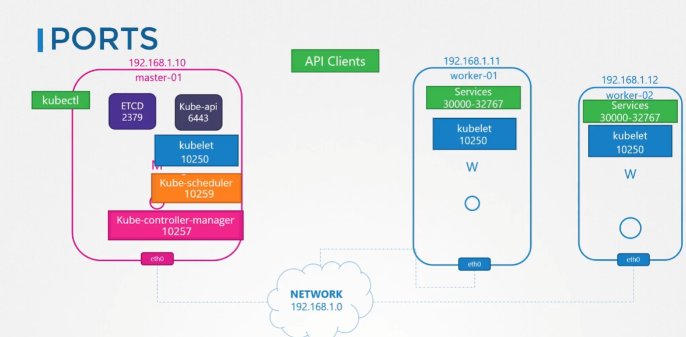
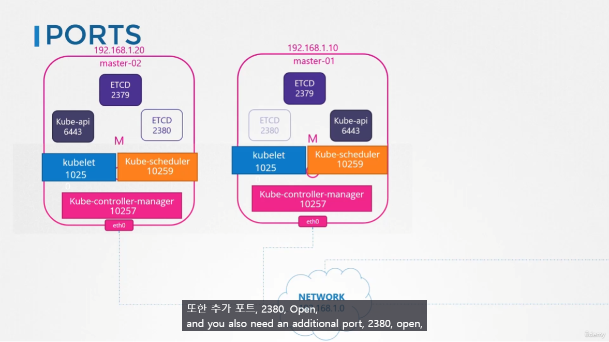
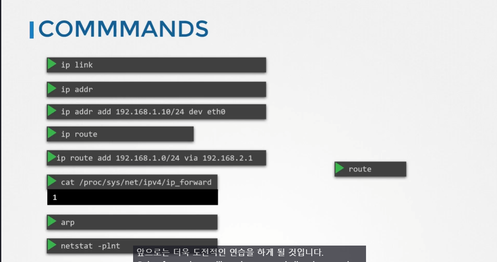

# Pre-requisite Cluster Networking
  - Take me to [Lecture](https://kodekloud.com/topic/cluster-networking/)

In this section, we will take a look at **Pre-requisite of the Cluster Networking**
- Set the unique hostname.
- Get the IP addr of the system (master and worker node).
- Check the Ports.

## IP and Hostname

포트들을 열어줘야지 k8s가 정상적으로 작동함.


- 여러개의 Master Node 가 있는 경우 master node에서 k8s 컴포넌트들의 포트를 각각 열어줘야함.
	- ETCD 가 2380 포트로 열리는 것도 차이.

## Command 정리


- To view the hostname
```
$ hostname 
```

- To view the IP addr of the system
```
$ ip a
```


## Set the hostname
```
$ hostnamectl set-hostname <host-name>

$ exec bash
```

## View the Listening Ports of the system
```
$ netstat -nltp
```


#### References Docs
- https://kubernetes.io/docs/setup/production-environment/tools/kubeadm/install-kubeadm/#check-required-ports
- https://kubernetes.io/docs/concepts/cluster-administration/networking/