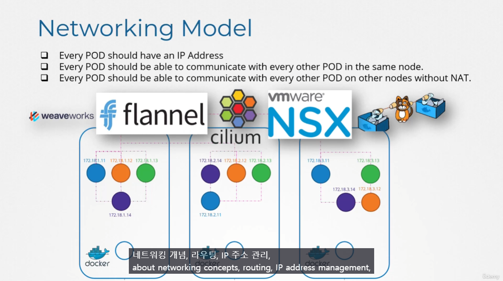
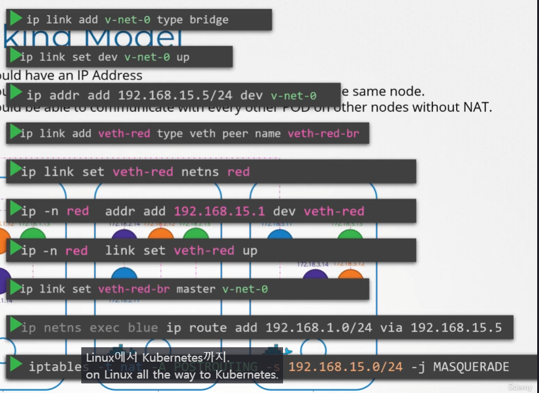
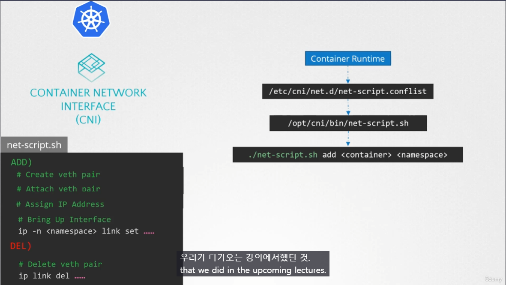

# Pod Networking
  - Take me to [Lecture](https://kodekloud.com/topic/pod-networking/)
In this section, we will take a look at **Pod Networking**
## K8s Networking Model

k8s는 모든 노드안에서 unique한 IP address 를 가지도록 한다.



- To add bridge network on each node
> node01
```
$ ip link add v-net-0 type bridge
```
> node02
```
$ ip link add v-net-0 type bridge
```

> node03
```
$ ip link add v-net-0 type bridge
```

- Currently it's down, turn it up.
> node01
```
$ ip link set dev v-net-0 up
```

> node02
```
$ ip link set dev v-net-0 up
```

> node03
```
$ ip link set dev v-net-0 up
```

- Set the IP Addr for the bridge interface
> node01
```
$ ip addr add 10.244.1.1/24 dev v-net-0
```

> node02
```
$ ip addr add 10.244.2.1/24 dev v-net-0
```

> node03
```
$ ip addr add 10.244.3.1/24 dev v-net-0
```


- Check the reachability 
```
$ ping 10.244.2.2
Connect: Network is unreachable
```

- Add route in the routing table
```
$ ip route add 10.244.2.2 via 192.168.1.12
```

> node01
```
$ ip route add 10.244.2.2 via 192.168.1.12

$ ip route add 10.244.3.2 via 192.168.1.13
```

> node02
```
$ ip route add 10.244.1.2 via 192.168.1.11

$ ip route add 10.244.3.2 via 192.168.1.13

```

> node03
```
$ ip route add 10.244.1.2 via 192.168.1.11

$ ip route add 10.244.2.2 via 192.168.1.12
```
**근데 이렇게 POD가 생성될 때 마다 각 노드에서 Routing Table 을 채워주는 것은 너무 비효율적.**

- Add a single large network 

하나의 큰 네트워크에서 Routing Table을 채워줌.

## Container Network Interface



CNI 표준에 따라 `ADD`, `DEL` 할 때의 수행해야 하는 것들을 정의해놨음.
#### 컨테이너 생성 시 수행
1. Conatiner Runtime 컨테이너 생성
2. `net-script.conflist` 에 있는 CNI configuration 확인
3. `net-script` 에 있는 매칭되는 스크립트을 찾고
4. 스크립트 수행 (`ADD`, `DEL`)


#### References Docs

- https://kubernetes.io/docs/concepts/workloads/pods/