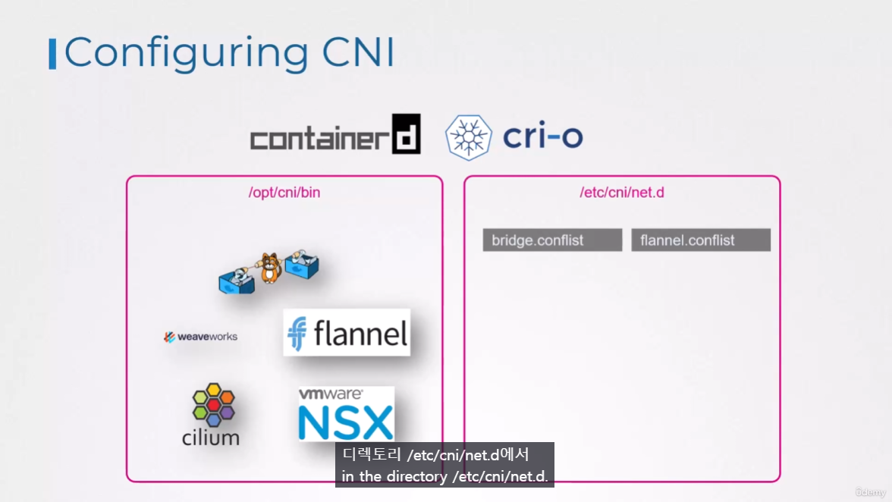

# CNI in Kubernetes
  - Take me to [Lecture](https://kodekloud.com/topic/cni-in-kubernetes/)
In this section, we will take a look at **Container Networking Interface (CNI) in Kubernetes**

## Configuring CNI

- Plugin 은 이미 `/opt/cni/bin` 에 설치되어 있음.
- `/etc/cni/net.d` 에 이 Plugin 들의 config file이 저장됨.


- Check the status of the Kubelet Service
```
$ systemctl status kubelet.service
```

## View Kubelet Options
```
$ ps -aux | grep kubelet
```

## Check the Supportable Plugins 

- To check the all supportable plugins available in the `/opt/cni/bin` directory.
```
$ ls /opt/cni/bin

```

## Check the CNI Plugins
- To check the cni plugins which kubelet needs to be used.
```
ls /etc/cni/net.d
```

## Format of Configuration File  


#### References Docs
- https://kubernetes.io/docs/reference/command-line-tools-reference/kubelet/
- https://kubernetes.io/docs/concepts/extend-kubernetes/compute-storage-net/network-plugins/