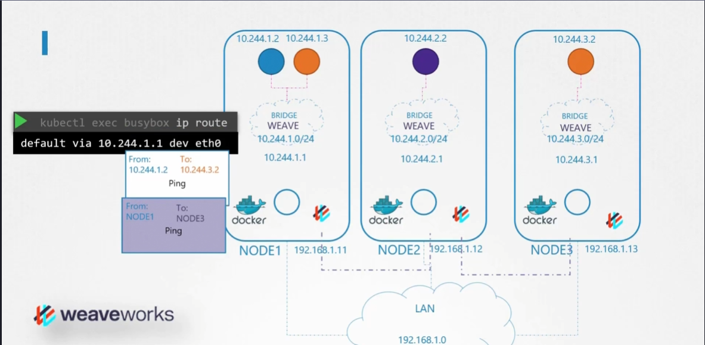
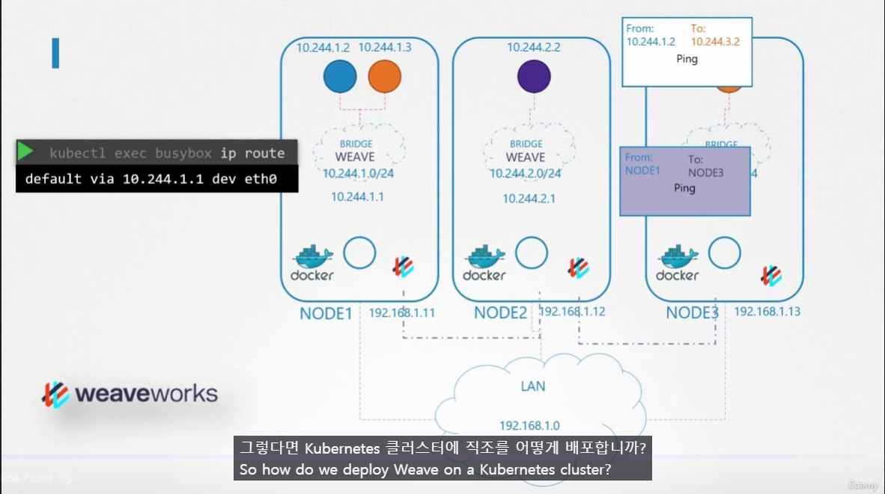

# CNI weave
  - Take me to [Lecture](https://kodekloud.com/topic/cni-weave/)

In this section, we will take a look at "CNI Weave in the Kubernetes Cluster"

## Weave Concept
#### 전송

#### 수신

- 각 Node 에는 weave peer 가 존재함.
	- 각 weave peer 는 Node와 Network에 관한 정보를 교환하고 통신함.

1. 특정 POD 가 전송 명령
2. 그 노드에 있는 weave peer 가 이 패킷을 intercept 해서 weave 정보로 encapsulation 후 node 밖으로 전송
3. Destination Node 에 있는 weave peer 가 패킷을 intercept 해서 decapsulation 후 target pod 로 전송

## Deploy Weave
- Installing [weave net](https://www.weave.works/docs/net/latest/kubernetes/kube-addon/) onto the Kubernetes cluster with a single command.
```
$ kubectl apply -f "https://cloud.weave.works/k8s/net?k8s-version=$(kubectl version | base64 | tr -d '\n')"
serviceaccount/weave-net created
clusterrole.rbac.authorization.k8s.io/weave-net created
clusterrolebinding.rbac.authorization.k8s.io/weave-net created
role.rbac.authorization.k8s.io/weave-net created
rolebinding.rbac.authorization.k8s.io/weave-net created
daemonset.apps/weave-net created
```
> [!important]
> daemonset 으로 배포되기 때문에 모든 node에 하나씩 존재하는 것이 보장

## Weave Peers
```
$ kubectl get pods -n kube-system
NAME                                      READY   STATUS             RESTARTS   AGE
coredns-66bff467f8-894jf                  1/1     Running            0          52m
coredns-66bff467f8-nck5f                  1/1     Running            0          52m
etcd-controlplane                         1/1     Running            0          52m
kube-apiserver-controlplane               1/1     Running            0          52m
kube-controller-manager-controlplane      1/1     Running            0          52m
kube-keepalived-vip-mbr7d                 1/1     Running            0          52m
kube-proxy-p2mld                          1/1     Running            0          52m
kube-proxy-vjcwp                          1/1     Running            0          52m
kube-scheduler-controlplane               1/1     Running            0          52m
weave-net-jgr8x                           2/2     Running            0          45m
weave-net-tb9tz                           2/2     Running            0          45m
```

## View the logs of Weave Pod's
```
$ kubectl logs weave-net-tb9tz weave -n kube-system 
```

## View the default route in the Pod
```
$ kubectl run test --image=busybox --command -- sleep 4500
pod/test created

$ kubectl exec test -- ip route
default via 10.244.1.1 dev eth0
```


#### References Docs

- https://kubernetes.io/docs/concepts/cluster-administration/addons/
- https://www.weave.works/docs/net/latest/kubernetes/kube-addon/