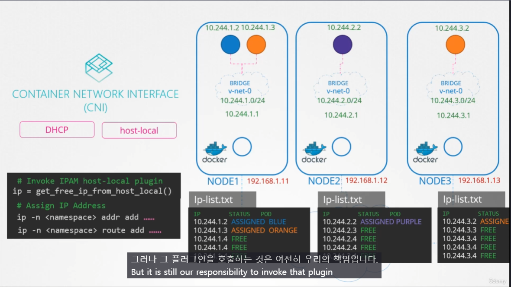
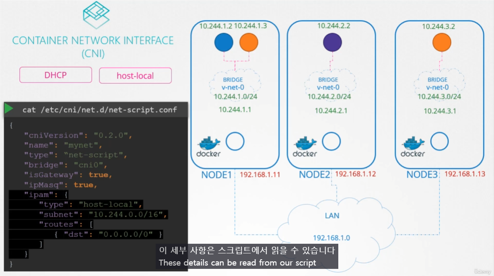

# IPAM weave
  - Take me to [Lecture](https://kodekloud.com/topic/ipam-weave/)

- IP Address Management in the Kubernetes Cluster

CNI Plugin Responsibilities 에 따르면 Plugin 이 POD 에 IP Addr 를 할당하고 관리해야한다는 항목이 있음.
-> k8s는 이것에 관여하지 않음. 

`/etc/cni/netd/net-script.conf` 의 `ipam` 항목에서 plugin 을 선택할 수 있음. ^e558cs

- How weaveworks Manages IP addresses in the Kubernetes Cluster 

## References Docs
- https://www.weave.works/docs/net/latest/kubernetes/kube-addon/
- https://kubernetes.io/docs/concepts/cluster-administration/networking/ 