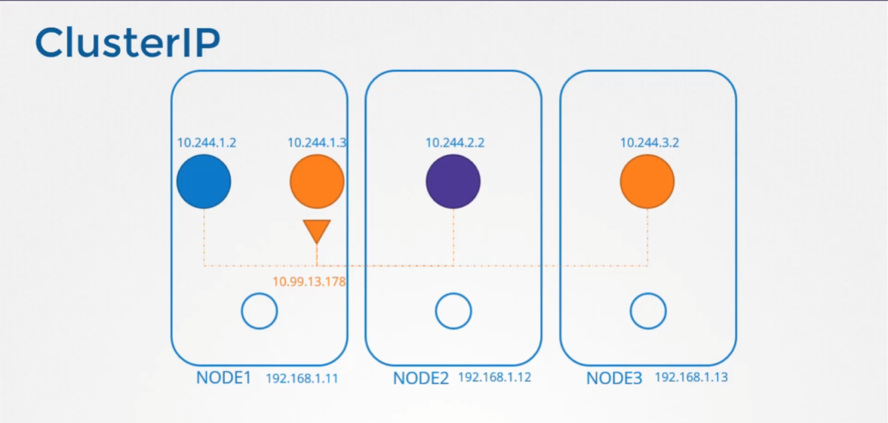
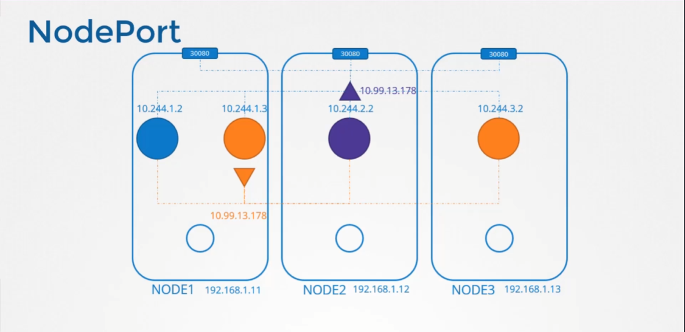
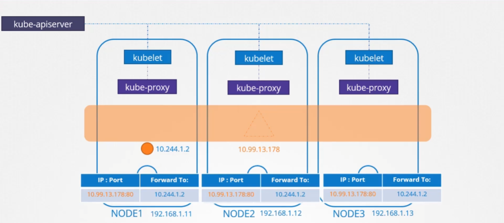
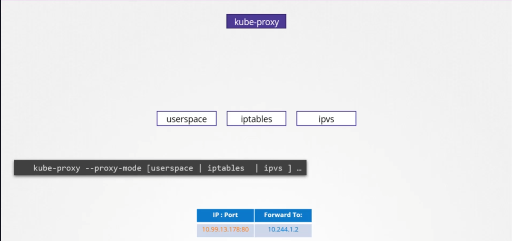
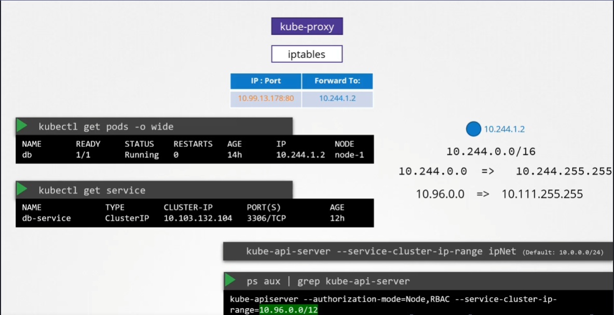
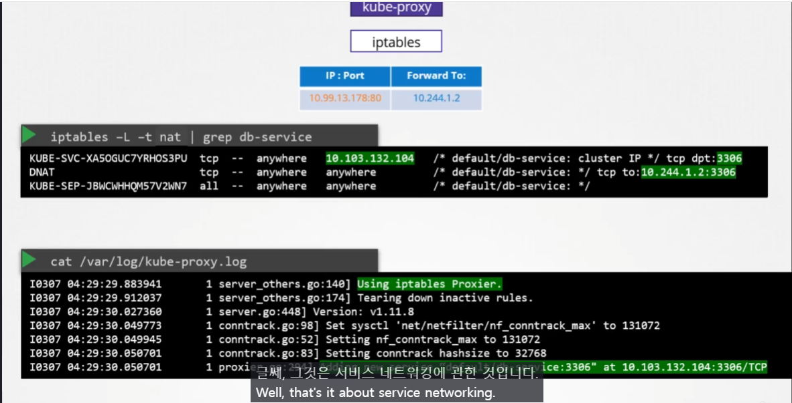

# Service Networking
  - Take me to [Lecture](https://kodekloud.com/topic/service-networking/)

In this section, we will take a look at **Service Networking**

## Service Types
- ClusterIP 
	- **클러스터 내부**에서만 접근 가능
	- 노드 하나에 Binding 되지 않으며 **클러스터 내 모든 POD 접근 가능**

```
clusterIP.yaml

apiVersion: v1
kind: Service
metadata:
  name: local-cluster
spec:
  ports:
  - port: 80
    targetPort: 80
  selector:
    app: nginx
```

- NodePort
	- ClusterIP의 기능을 동일하게 가짐
		- 모든 노드의 POD가 접근 가능
	- 모든 노드에서 포트를 열어서 **클러스터 외부의 사용자가 App이 접근**할 수 있음.

```
nodeportIP.yaml

apiVersion: v1
kind: Service
metadata:
  name: nodeport-wide
spec:
  type: NodePort
  ports:
  - port: 80
    targetPort: 80
  selector:
    app: nginx
```

## Kubernetes Service Concept

- `Service` 는 Pod 처럼 실제로 존재하는 객체가 아님.
	- 가상의 객체이고 특정 노드에 존재하지 않으며 Cluster 전체의 개념임.
	- Network Interface를 가지던 Pod와 다르게 가상의 객체이므로 이러한 인터페이스를 가지지 않음.
- 그래서 각 노드마다 Forwarding Table 을 가지고 있음.
- `Service` 의 주소에 해당하는 `IP:Port` 가 들어올 경우 그 `Service`에 연결되어 있는 Pod Forwarding 해줌.
- `Service`가 생성될 때 마다 **`kube-proxy`가 이러한 규칙을 생성하거나 삭제함.** ^rkwg83

### `kube-proxy` Rule 생성

- 다양한 옵션을 줄 수 있으며 기본 값은 `iptables`

## To create the service 
```
$ kubectl create -f clusterIP.yaml
service/local-cluster created

$ kubectl create -f nodeportIP.yaml
service/nodeport-wide created
```

## To get the Additional Information
```
$ kubectl get pods -o wide
NAME    READY   STATUS    RESTARTS   AGE   IP           NODE     NOMINATED NODE   READINESS GATES
nginx   1/1     Running   0          1m   10.244.1.3   node01   <none>           <no
```

## To get the Service
```
$ kubectl get service
NAME            TYPE        CLUSTER-IP      EXTERNAL-IP   PORT(S)        AGE
kubernetes      ClusterIP   10.96.0.1       <none>        443/TCP        5m22s
local-cluster   ClusterIP   10.101.67.139   <none>        80/TCP         3m
nodeport-wide   NodePort    10.102.29.204   <none>        80:30016/TCP   2m
```

## To check the Service Cluster IP Range 
```
$ ps -aux | grep kube-apiserver
--secure-port=6443 --service-account-key-file=/etc/kubernetes/pki/sa.pub --
service-cluster-ip-range=10.96.0.0/12
```

- `Service`에 할당될 IP 범위를 `kube-api-server --service-cluster-ip-range ipNet` 으로 줄 수 있음.
	- default 값은 `10.0.0.0/24`
- `ps aux | grep kube-api-server` 를 통해 현재 설정 된 service ip range 를 확인할 수 있음.
> [!warning]
>  **[POD ip 범위](docs/09-Networking/15-ipam-weave.md#^e558cs) 와 겹치지 않도록 해야함.**

## To check the rules created by kube-proxy in the iptables
- `iptables` 명령어로 **`DNAT` rule 을 통해 Service를 구현**하고 있는 것을 확인 할 수 있음.

```
$ iptables -L -t nat | grep local-cluster
KUBE-MARK-MASQ  all  --  10.244.1.3           anywhere             /* default/local-cluster: */
DNAT       tcp  --  anywhere             anywhere             /* default/local-cluster: */ tcp to:10.244.1.3:80
KUBE-MARK-MASQ  tcp  -- !10.244.0.0/16        10.101.67.139        /* default/local-cluster: cluster IP */ tcp dpt:http
KUBE-SVC-SDGXHD6P3SINP7QJ  tcp  --  anywhere             10.101.67.139        /* default/local-cluster: cluster IP */ tcp dpt:http
KUBE-SEP-GEKJR4UBUI5ONAYW  all  --  anywhere             anywhere             /* default/local-cluster: */
```

## To check the logs of kube-proxy
- `/var/log` 경로에 있는 `kube-proxy` 로그 파일로 확인하는 방법
	- May this file location is vary depends on your installation process.
```
$ cat /var/log/kube-proxy.log
```

#### References Docs

- https://kubernetes.io/docs/concepts/services-networking/service/