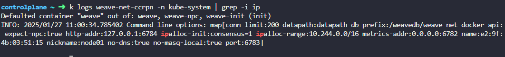
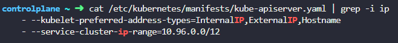

# Practice Test Service Networking

  - Take me to [Practice Test](https://kodekloud.com/topic/practice-test-service-networking/)

### 풀이
- node의 ip 범위 확인
	- `kubectl get nodes -o wide` 로 node에 할당된 ip주소 확인
	- `ip addr` 로 node 에 할당된 주소를 찾고 CIDR(IP 주소 `/` ) 를 확인하여 ip 범위 확인
- pod의 ip 범위 확인
	- `kubectl get nodes --all-namespaces -o wide` 로 network plugin 확인
	- `kubectl logs <weave-pods-name> -n kube-system` 의 로그에서 `ipalloc` 항목 확인
	- 
- Service의 ip 범위 확인
	- `cat /etc/kubernetes/manifests/kube-apiserver.yaml` 으로 `kube-apiserver` config 확인
	- 
- **`describe`로 뭔가 안나올때는 `logs` 도 확인하자.**
#### Solution 

1. <details>
   <summary>What network range are the nodes in the cluster part of?</summary>

   ```
   kubectl get nodes -o wide
   ```

   Note the INTERNAL-IP column to derive:

   ```
   192.20.116.0/24
   ```
   </details>

2. <details>
   <summary>What is the range of IP addresses configured for PODs on this cluster?</summary>

   ```
   kubectl get pods -A -o wide
   ```

   From this list, exclude the static control plane pods like `kube-apiserver` as these run on the host network, not the pod network. From the remaining pods we can derive:

   ```
   10.244.0.0/16
   ```
   </details>

3. <details>
   <summary>What is the IP Range configured for the services within the cluster?</summary>

   ```
   kubectl get service -A
   ```

   Note the CLUSTER-IP column to derive:

   ```
   10.96.0.0/12
   ```
   </details>

4. <details>
   <summary>How many kube-proxy pods are deployed in this cluster?</summary>

   ```
   kubectl get pod -n kube-system | grep kube-proxy
   ```

   Count the results
   </details>

5. <details>
   <summary>What type of proxy is the kube-proxy configured to use?</summary>

   From the output of the above question, you have two kube-proxy pods, e.g.

   ```
   controlplane ~ kubectl get pod -n kube-system | grep kube-proxy
   kube-proxy-rtr8p                       1/1     Running   0             56m
   kube-proxy-t7w8f                       1/1     Running   0             56m
   ```

   Pick either and check its logs. The answer is there.

   ```
   k logs -n kube-system kube-proxy-rtr8p
   ```
   </details>

6. <details>
   <summary>How does this Kubernetes cluster ensure that a kube-proxy pod runs on all nodes in the cluster?</summary>

   ```
   kubectl get all -n kube-system
   ```

   From this, you can see that `kube-proxy` is a `daemonset`
   </details>

