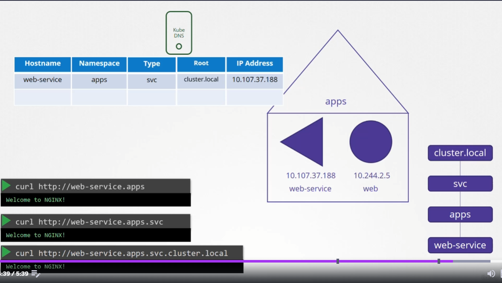
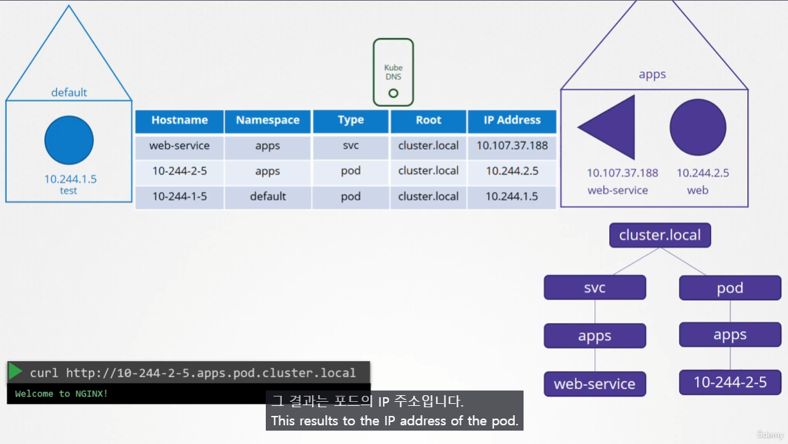

# DNS in Kubernetes
  - Take me to [Lecture](https://kodekloud.com/topic/dns-in-kubernetes/)
In this section, we will take a look at **DNS in the Kubernetes Cluster**

## 강의 정리
- kubernetes 는 cluster를 setup 할 때 built-in DNS 서버를 배포함.
	- DNS 관점에서는 객체가 어느 노드에 위치하는지는 상관없음.

### DNS in `Service`

Root - Type - Namespace - Hostname 로 세분화되는 구조를 가짐.
-> 그래서 Full 주소는 `<Hostname>.<Namespace>.<Type>.<Root>`
- Root 의 default 값은 `cluster.local`
	- 따로 설정하지 않는 이상 Pod, Service 상관없이 고정
- Type : `svc`
- Namespace
- Hostname

### DNS in `POD`

- default로는 POD가 DNS에 저장되지 않음.
	- 따로 옵션을 줘야함.
- DNS Table에 저장되는 방식
	- Type : `pod`
	- Hostname : Pod IP 주소의 `.` 을 `-`로 변경한 값

## Pod DNS Record
- The following DNS resolution:
```
<POD-IP-ADDRESS>.<namespace-name>.pod.cluster.local
```
> Example
```
# Pod is located in a default namespace

10-244-1-10.default.pod.cluster.local
```

```
# To create a namespace
$ kubectl create ns apps

# To create a Pod
$ kubectl run nginx --image=nginx --namespace apps

# To get the additional information of the Pod in the namespace "apps"
$ kubectl get po -n apps -owide
NAME    READY   STATUS    RESTARTS   AGE   IP           NODE     NOMINATED NODE   READINESS GATES
nginx   1/1     Running   0          99s   10.244.1.3   node01   <none>           <none>

# To get the dns record of the nginx Pod from the default namespace
$ kubectl run -it test --image=busybox:1.28 --rm --restart=Never -- nslookup 10-244-1-3.apps.pod.cluster.local
Server:    10.96.0.10
Address 1: 10.96.0.10 kube-dns.kube-system.svc.cluster.local

Name:      10-244-1-3.apps.pod.cluster.local
Address 1: 10.244.1.3
pod "test" deleted

# Accessing with curl command
$ kubectl run -it nginx-test --image=nginx --rm --restart=Never -- curl -Is http://10-244-1-3.apps.pod.cluster.local
HTTP/1.1 200 OK
Server: nginx/1.19.2

```

## Service DNS Record
- The following DNS resolution:
```
<service-name>.<namespace-name>.svc.cluster.local
```
> Example
```
# Service is located in a default namespace

web-service.default.svc.cluster.local
```
- Pod, Service is located in the `apps` namespace
```
# Expose the nginx Pod
$ kubectl expose pod nginx --name=nginx-service --port 80 --namespace apps
service/nginx-service exposed

# Get the nginx-service in the namespace "apps"
$ kubectl get svc -n apps
NAME            TYPE        CLUSTER-IP      EXTERNAL-IP   PORT(S)   AGE
nginx-service   ClusterIP   10.96.120.174   <none>        80/TCP    6s

# To get the dns record of the nginx-service from the default namespace
$ kubectl run -it test --image=busybox:1.28 --rm --restart=Never -- nslookup nginx-service.apps.svc.cluster.local
Server:    10.96.0.10
Address 1: 10.96.0.10 kube-dns.kube-system.svc.cluster.local

Name:      nginx-service.apps.svc.cluster.local
Address 1: 10.96.120.174 nginx-service.apps.svc.cluster.local
pod "test" deleted

# Accessing with curl command
$ kubectl run -it nginx-test --image=nginx --rm --restart=Never -- curl -Is http://nginx-service.apps.svc.cluster.local
HTTP/1.1 200 OK
Server: nginx/1.19.2

```

#### References Docs
- https://kubernetes.io/docs/concepts/services-networking/dns-pod-service/
- https://kubernetes.io/docs/tasks/administer-cluster/dns-debugging-resolution/