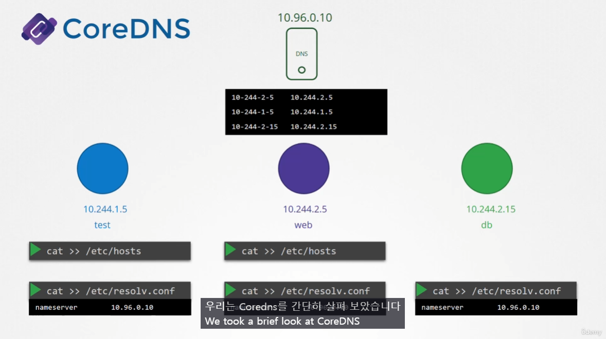
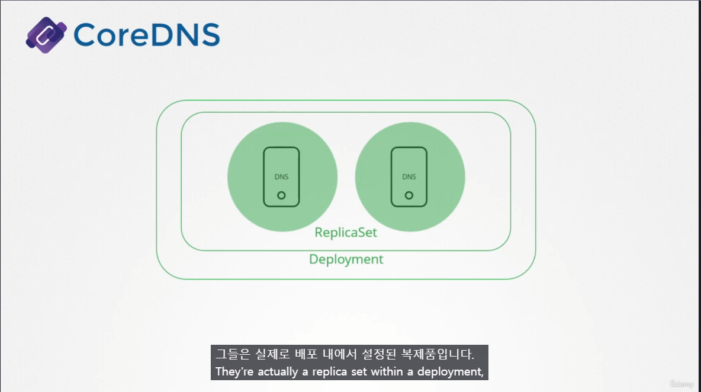
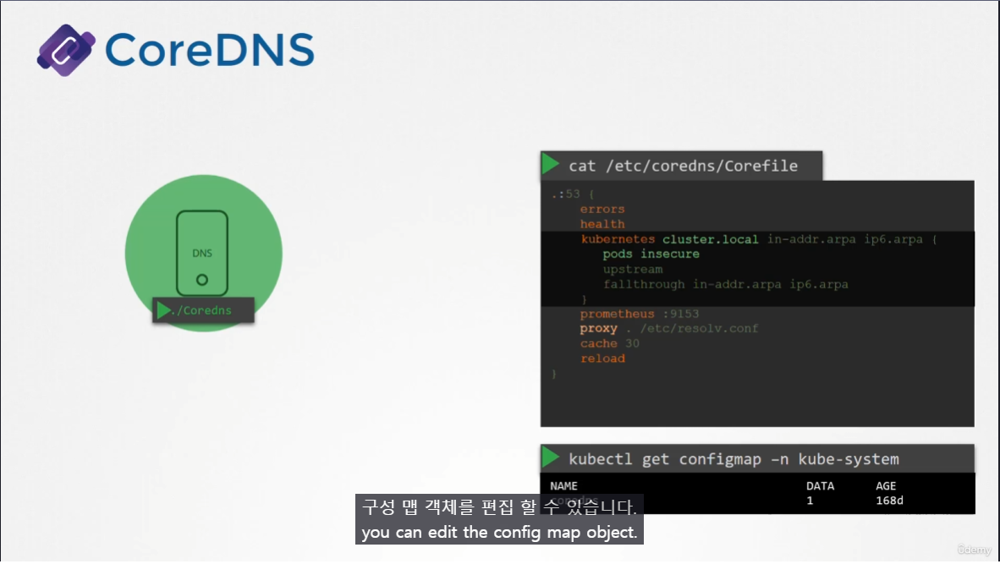
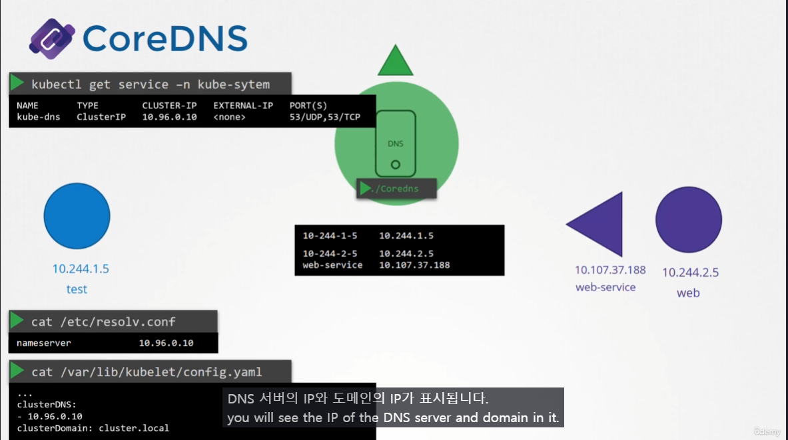
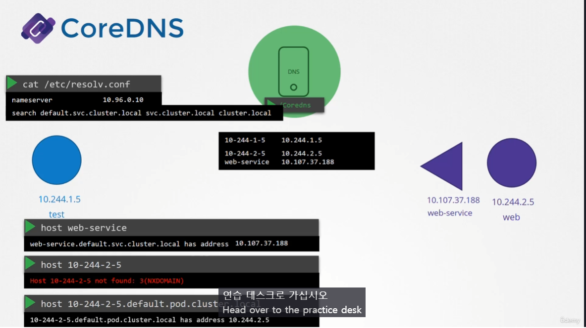

# CoreDNS in Kubernetes
  - Take me to [Lecture](https://kodekloud.com/topic/coredns-in-kubernetes/)
In this section, we will take a look at **CoreDNS in the Kubernetes**

## 강의정리

v1.12 이후 부터는 `CoreDNS` 를 사용하는 것이 권장됨.

### POD로 배포

Replicaset 으로 2개의 POD로 배포되며 Deployment로 쌓여있는 구조..?

### Corefile

`/etc/coredns/Corefile`을 보면 plugin 에 대한 정보들이 저장되어 있으며 kubernetes 에 대한 DNS 설정도 이 파일에서 변경할 수 있다.
이 Corefile은 `kube-system` namespace에 `configmap` 으로 전달되어 적용된다.

### kube-dns

Coredns는 POD 형식으로 배포되므로 이 Coredns POD 에 접근할 수 있도록 `serivce` 를 만들어야함 -> **`kube-dns`**

- 각 POD 에서 DNS configuration 을 담당하는 것은 **`kubelet`**
	- kubelet config 에 가면 ClusterDNS 항목에 `kube-dns` Service IP 가 등록되어있음.
	- POD에서 DNS 서버를 저장하는 경로 `/etc/resolv.conf` 에 가서 확인해보면 `kube-dns` service의 IP가 적혀있는 것을 확인할 수 있다.

### POD 에서 CoreDNS 사용

- CoreDNS 에서 `Service` 객체의 경우 클러스터 내부 리소스를 쿼리할 수 있는 기능을 지원한다.
	- Service의 경우 Full Address (FQDN) 을 적지 않아도 접속이 가능.
	- 그러나 다른 객체(POD 등) 은 FQDN 을 반드시 적어줘야지 접속이 가능.

## To view the Pod
```
$ kubectl get pods -n kube-system
NAME                                      READY   STATUS    RESTARTS   AGE
coredns-66bff467f8-2vghh                  1/1     Running   0          53m
coredns-66bff467f8-t5nzm                  1/1     Running   0          53m
```

## To view the Deployment
```
$ kubectl get deployment -n kube-system
NAME                      READY   UP-TO-DATE   AVAILABLE   AGE
coredns                   2/2     2            2           53m
```

## To view the configmap of CoreDNS
```
$ kubectl get configmap -n kube-system
NAME                                 DATA   AGE
coredns                              1      52m
```

## CoreDNS Configuration File
```
$ kubectl describe cm coredns -n kube-system

Corefile:
---
.:53 {
    errors
    health {       lameduck 5s
    }
    ready
    kubernetes cluster.local in-addr.arpa ip6.arpa {
       pods insecure
       fallthrough in-addr.arpa ip6.arpa
       ttl 30
    }
    prometheus :9153
    forward . /etc/resolv.conf
    cache 30
    loop
    reload
}
```

## To view the Service 
```
$ kubectl get service -n kube-system
NAME       TYPE        CLUSTER-IP   EXTERNAL-IP   PORT(S)                  AGE
kube-dns   ClusterIP   10.96.0.10   <none>        53/UDP,53/TCP,9153/TCP   62m
```

## To view Configuration into the kubelet 
```
$ cat /var/lib/kubelet/config.yaml | grep -A2  clusterDNS
clusterDNS:
- 10.96.0.10
clusterDomain: cluster.local

```

## To view the fully qualified domain name
- With the `host` command, we will get fully qualified domain name (FQDN).
```
$ host web-service
web-service.default.svc.cluster.local has address 10.106.112.101

$ host web-service.default
web-service.default.svc.cluster.local has address 10.106.112.101

$ host web-service.default.svc
web-service.default.svc.cluster.local has address 10.106.112.101

$ host web-service.default.svc.cluster.local
web-service.default.svc.cluster.local has address 10.106.112.101
```

## To view the `/etc/resolv.conf` file
```
$ kubectl run -it --rm --restart=Never test-pod --image=busybox -- cat /etc/resolv.conf
nameserver 10.96.0.10
search default.svc.cluster.local svc.cluster.local cluster.local
options ndots:5
pod "test-pod" deleted
```

## Resolve the Pod 
```
$ kubectl get pods -o wide
NAME      READY   STATUS    RESTARTS   AGE     IP           NODE     NOMINATED NODE   READINESS GATES
test-pod   1/1     Running   0          11m     10.244.1.3   node01   <none>           <none>
nginx      1/1     Running   0          10m     10.244.1.4   node01   <none>           <none>

$ kubectl exec -it test-pod -- nslookup 10-244-1-4.default.pod.cluster.local
Server:    10.96.0.10
Address 1: 10.96.0.10 kube-dns.kube-system.svc.cluster.local

Name:      10-244-1-4.default.pod.cluster.local
Address 1: 10.244.1.4 
```

## Resolve the Service
```
$ kubectl get service
NAME          TYPE        CLUSTER-IP       EXTERNAL-IP   PORT(S)   AGE
kubernetes    ClusterIP   10.96.0.1        <none>        443/TCP   85m
web-service   ClusterIP   10.106.112.101   <none>        80/TCP    9m

$ kubectl exec -it test-pod -- nslookup web-service.default.svc.cluster.local
Server:    10.96.0.10
Address 1: 10.96.0.10 kube-dns.kube-system.svc.cluster.local

Name:      web-service.default.svc.cluster.local
Address 1: 10.106.112.101 web-service.default.svc.cluster.local

```


#### References Docs
- https://kubernetes.io/docs/concepts/services-networking/dns-pod-service/#services
- https://kubernetes.io/docs/concepts/services-networking/dns-pod-service/#pods
