# Ingress
  - Take me to [Lecture](https://kodekloud.com/topic/ingress/)
In this section, we will take a look at **Ingress**
- Ingress Controller
- Ingress Resources

> [!faq]
> `Service` 와 `Ingress` 의 차이는 무엇인가?
# Ingress Overview
### On-premise 환경에서의 배포
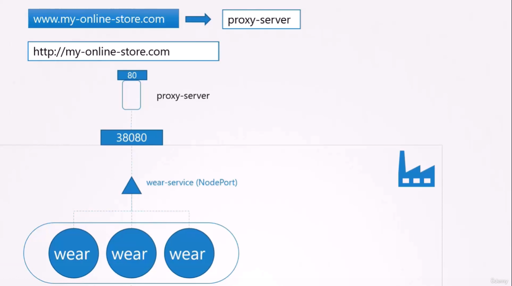
웹 서버를 k8s를 통하여 배포하려면
- Deployment의 Nodeport service
- 프록시 서버 설정
	- 사용자가 포트 번호 없이 hostname 만으로 접속하기 위함.
- `https` 사용하려면 SSH 설정
- DNS Node-ip 설정

### Cloud 환경에서의 배포
#### 간단한 구조일 때
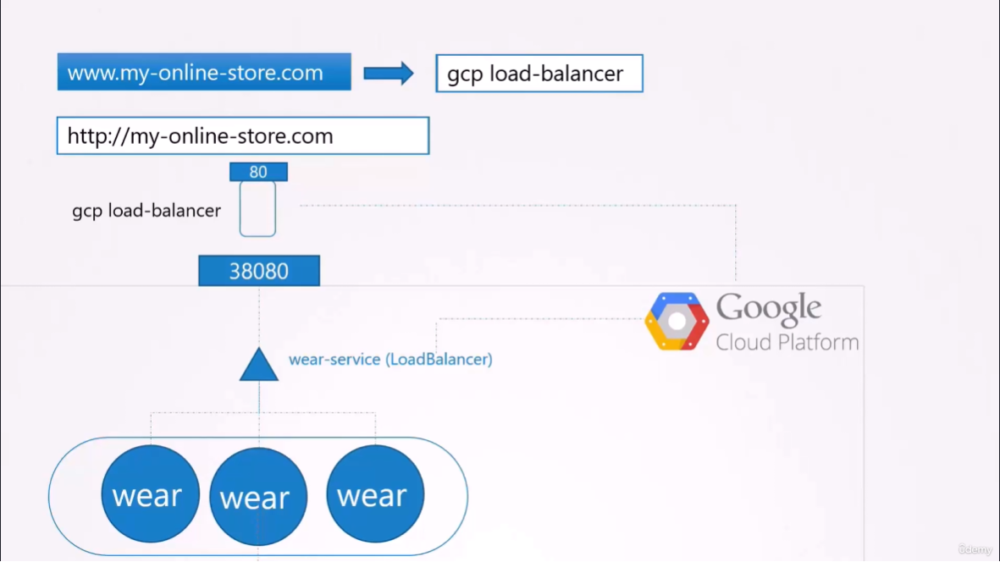
- Nodeport Service 가 아닌 LoadBalancer Service 사용
- 프록시 서버 대신 밖에서 cloud load-balancer 가 작동

#### 더 복잡한 구조..?
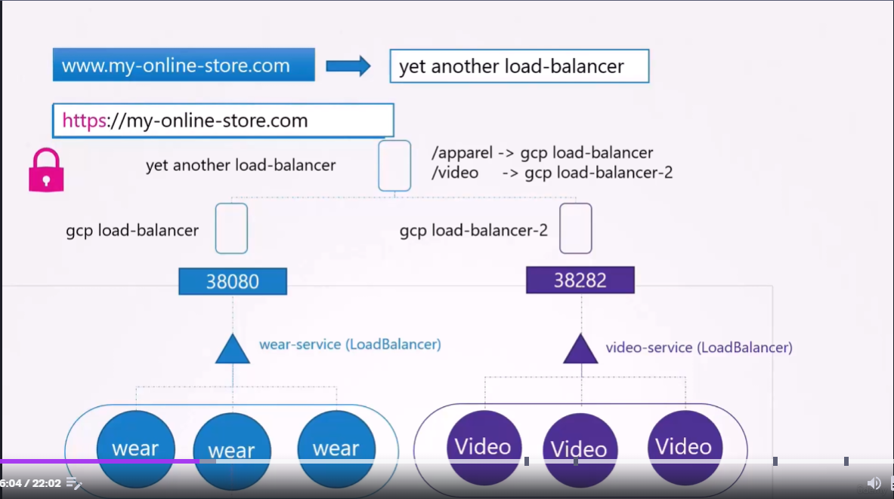
하나의 서비스가 추가될 때 마다 
- k8s Deployment
- k8s LoadBalancer
- gcp load-balancer 가 추가되어야 하며
	- 또 이 gcp load-balancer 로 로드밸런싱 해줄 또 다른 gcp-load-balancer 가 필요해진다.
> [!warning]
> 계속해서 Cloud Resource 사용량이 증가하게 되고 
> -> **이는 엄청난 비용 증가로 이어질 수 있다.**

> [!check]
> 이러한 관리의 어려움의 문제를 해결하기 위해 **`Ingress`** 등장
### Ingress
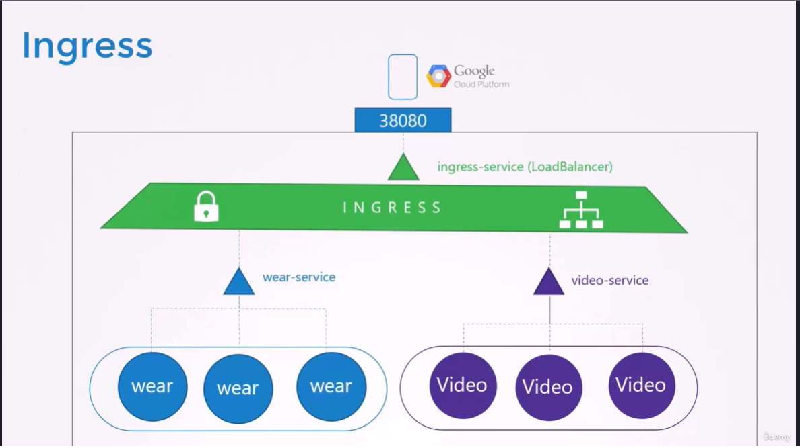
**kubernetes 내부의 L7 로드밸런서**
- 단일 URL로 접근할 수 있도록 함
- URL 경로기반 로드밸런싱
- SSL 보안 구현

https://kubernetes.io/ko/docs/concepts/services-networking/ingress/

### Ingress 구성
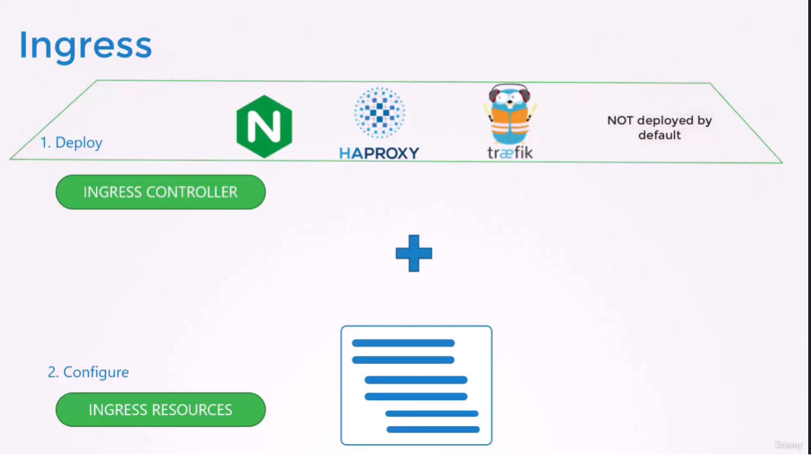
Ingress Controller 와 Ingress Resources 로 구성.

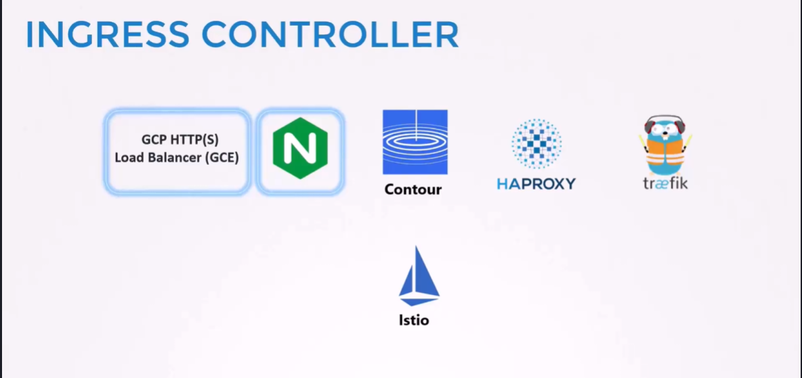
Ingress Controller 는 기본적으로 k8s에 포함되어 있지 않으므로 따로 선택해서 설치해야함.

# Ingress Controller
- Deployment of **Ingress Controller**

## ConfigMap
```
kind: ConfigMap
apiVersion: v1
metadata:
  name: nginx-configuration
```
- `Configmap` 을 만들어서 ingress-controller의 Deployment 옵션 전달
## Deployment
```
apiVersion: apps/v1
kind: Deployment
metadata:
  name: ingress-controller
spec:
  replicas: 1
  selector:
    matchLabels:
      name: nginx-ingress
  template:
    metadata:
      labels:
        name: nginx-ingress
    spec:
      serviceAccountName: ingress-serviceaccount
      containers:
        - name: nginx-ingress-controller
          image: quay.io/kubernetes-ingress-controller/nginx-ingress-controller:0.21.0
          args:
            - /nginx-ingress-controller
            - --configmap=$(POD_NAMESPACE)/nginx-configuration
          env:
            - name: POD_NAME
              valueFrom:
                fieldRef:
                  fieldPath: metadata.name
            - name: POD_NAMESPACE
              valueFrom:
                fieldRef:
                  fieldPath: metadata.namespace
          ports:
            - name: http
              containerPort: 80
            - name: https
              containerPort: 443
```
> [!note]
> 여기서의 Nginx ingress-controller는 기본적으로 알려진 Nginx Server 와는 다르다.
> -> **Nginx ingress-controller 에는 추가적인 기능들이 붙어있다.**


## ServiceAccount
- ServiceAccount require for authentication purposes along with correct Roles, ClusterRoles and RoleBindings.

- Create a ingress service account
```
$ kubectl create -f ingress-sa.yaml
serviceaccount/ingress-serviceaccount created
```

## Service Type - NodePort
외부에 Ingress Controller 를 expose 하기 위해서는 Service 가 필요.
```
# service-Nodeport.yaml

apiVersion: v1
kind: Service
metadata:
  name: ingress
spec:
  type: NodePort
  ports:
  - port: 80
    targetPort: 80
    protocol: TCP
    name: http
  - port: 443
    targetPort: 443
    protocol: TCP
    name: https
  selector:
    name: nginx-ingress
```

- Create a service
```
$ kubectl create -f service-Nodeport.yaml
```

- To get the service
```
$ kubectl get service
```

# Ingress Resources
### 단일 POD로 routing 할 때 (One Rule - One Path)
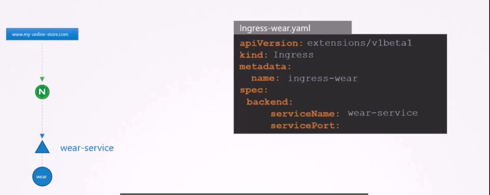
```
Ingress-wear.yaml

apiVersion: extensions/v1beta1
kind: Ingress
metadata:
  name: ingress-wear
spec:
     backend:
        serviceName: wear-service
        servicePort: 80
```
- `spec.backend` 아래 `serviceName` 과 `servicePort` 를 명시한다.
	- 당연히 POD가 아니라 Service 로 연결되도록 해야함.

- To create the ingress resource
```
$ kubectl create -f Ingress-wear.yaml
ingress.extensions/ingress-wear created
```

- To get the ingress
```
$ kubectl get ingress
NAME           CLASS    HOSTS   ADDRESS   PORTS   AGE
ingress-wear   <none>   *                 80      18s
```

## Ingress Resource - Rules
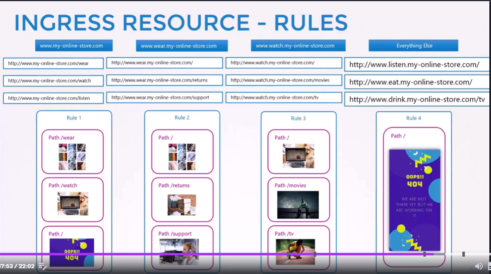
위 처럼 다양한 경로와 옵션들이 있을 수 있음.


### 1 Rule and 2 Paths.
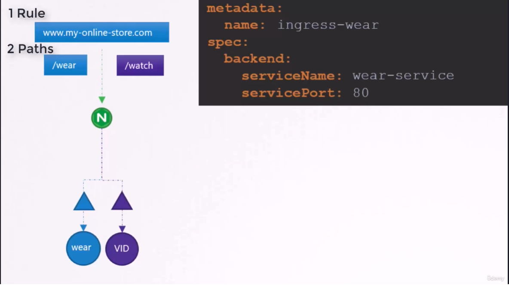
```
apiVersion: extensions/v1beta1
kind: Ingress
metadata:
  name: ingress-wear-watch
spec:
  rules:
  - http:
      paths:
      - path: /wear
        backend:
          serviceName: wear-service
          servicePort: 80
      - path: /watch
        backend:
          serviceName: watch-service
          servicePort: 80
```

- Describe the earlier created ingress resource
```
$ kubectl describe ingress ingress-wear-watch
Name:             ingress-wear-watch
Namespace:        default
Address:
Default backend:  default-http-backend:80 (<none>)
Rules:
  Host        Path  Backends
  ----        ----  --------
  *
              /wear    wear-service:80 (<none>)
              /watch   watch-service:80 (<none>)
Annotations:  <none>
Events:
  Type    Reason  Age   From                      Message
  ----    ------  ----  ----                      -------
  Normal  CREATE  23s   nginx-ingress-controller  Ingress default/ingress-wear-watch

```

### 2 Rules and 1 Path each.
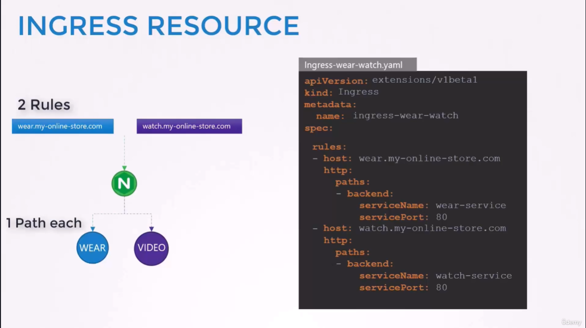
```
# Ingress-wear-watch.yaml

apiVersion: extensions/v1beta1
kind: Ingress
metadata:
  name: ingress-wear-watch
spec:
  rules:
  - host: wear.my-online-store.com
    http:
      paths:
      - backend:
          serviceName: wear-service
          servicePort: 80
  - host: watch.my-online-store.com
    http:
      paths:
      - backend:
          serviceName: watch-service
          servicePort: 80
```
`spec.rules.host` 를 지정하지 않으면 (이전의 예시처럼) Host URL 에 상관없이 들어오는 모든 input에 대하여 그 rule을 적용한다.

#### Path 기반 vs Host URL 기반
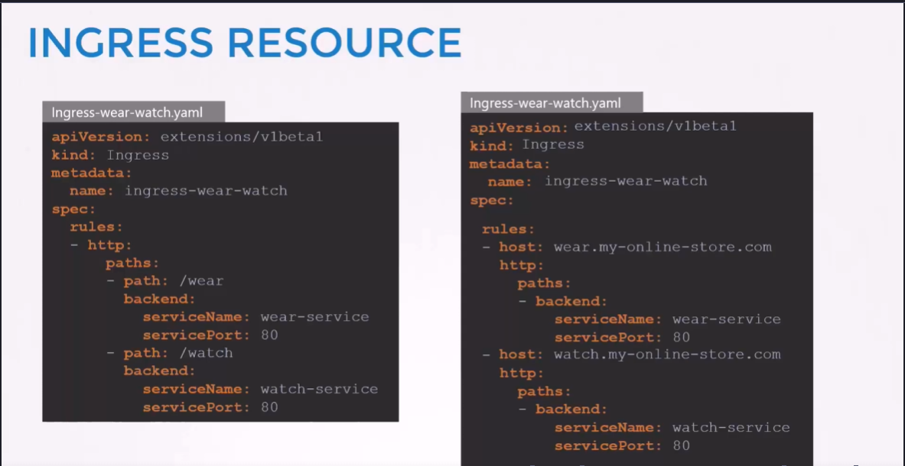


## v1.20 이후 변경사항
### .yaml 구성 변경
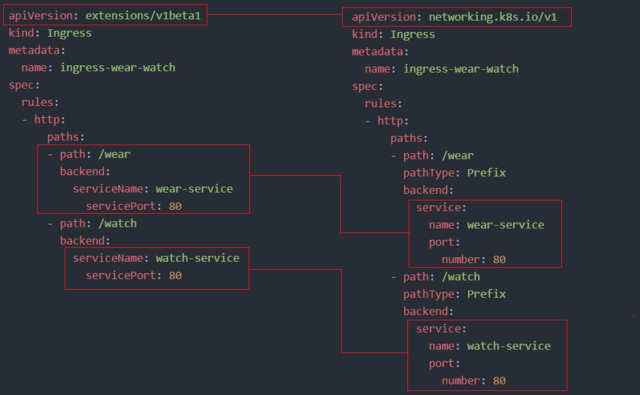
**apiVersion**, **serviceName**, **servicePort** yaml 구조가 변경됨.

### Imperative Command
#### Format
```
kubectl create ingress <ingress-name> --rule="host/path=service:port"
```
#### Example
```
kubectl create ingress ingress-test --rule="wear.my-onlinestore.com/wear*=wear-service:80"
```

#### References Docs
- https://kubernetes.io/docs/concepts/services-networking/ingress/
- https://kubernetes.io/docs/concepts/services-networking/ingress-controllers/
- https://thenewstack.io/kubernetes-ingress-for-beginners/