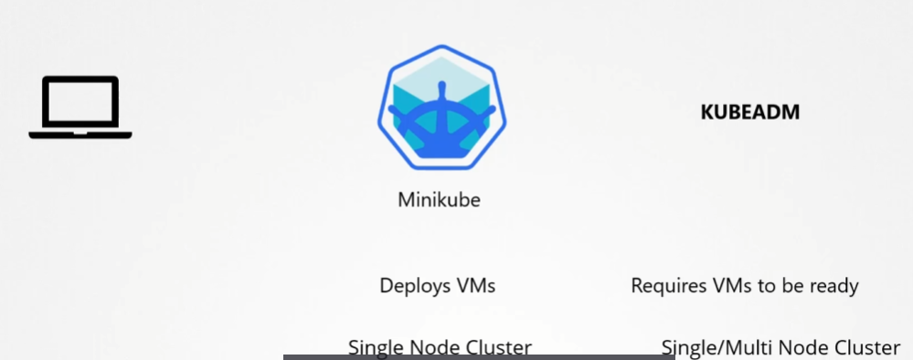
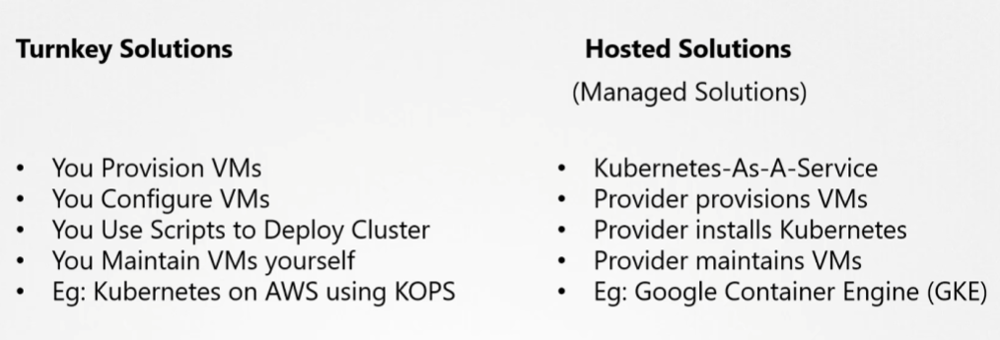

# Choosing a Kubernetes Infrastructure
  - Take me to [Lecture](https://kodekloud.com/topic/choosing-kubernetes-infrastructure/)

## 로컬 환경 배포
### Binary 직접 다운로드
- Linux : Binary 직접 다운 해서 배포는 가능하지만, 너무 복잡하고 힘듬
- Windows : Linux 기반의 VM

### Turnkey Solution
- OpenShift
- Cloud Foundry Container Runtime
- VMware Cloud PKS
- Vagrant

### Hosted Solutions
- GKE in Google cloud
- OpenShift Online
- Azure Kubernets Service
- EKS in AWS