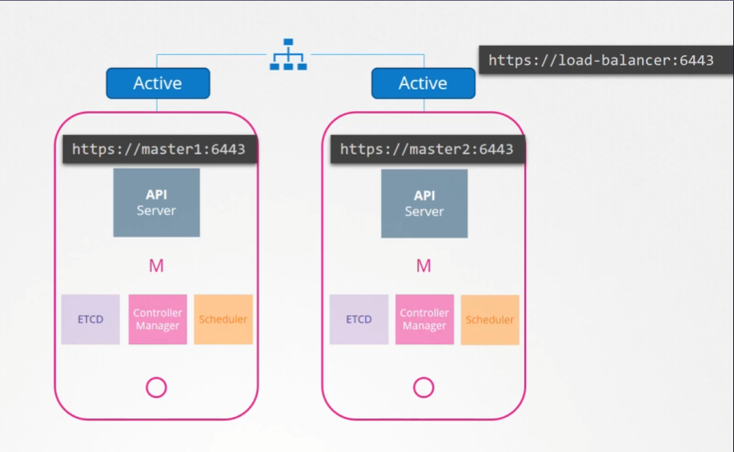
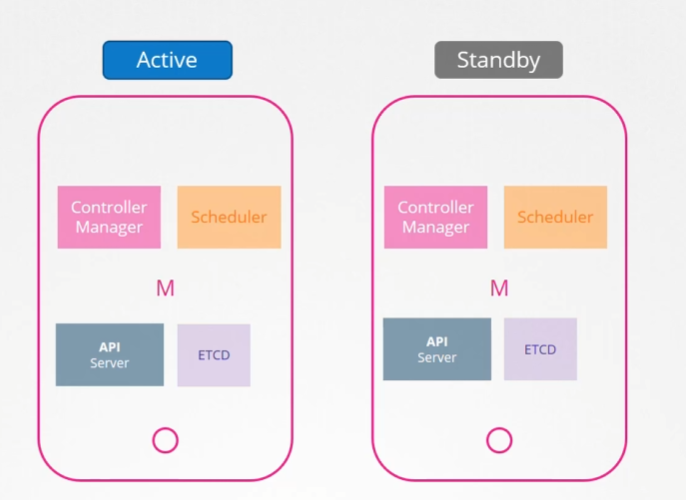
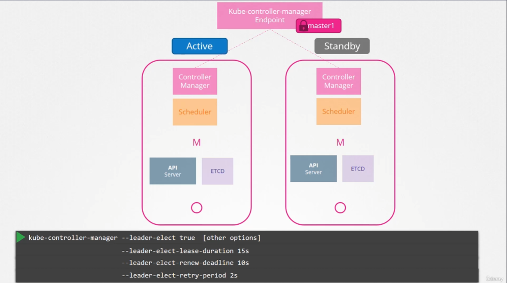
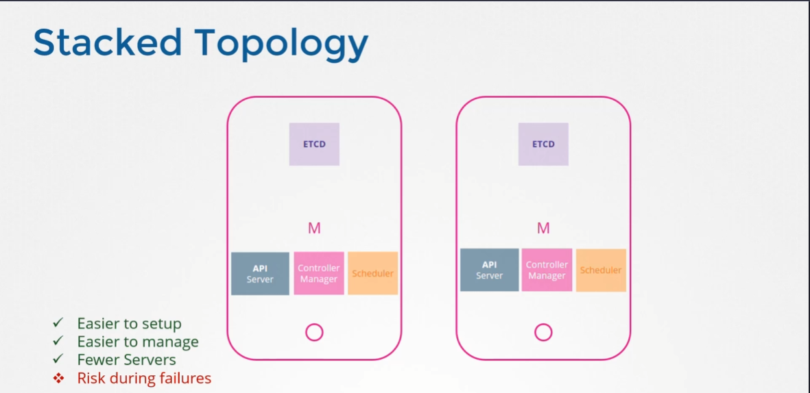
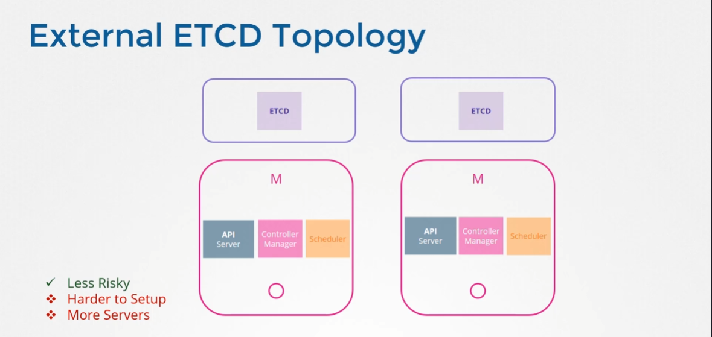
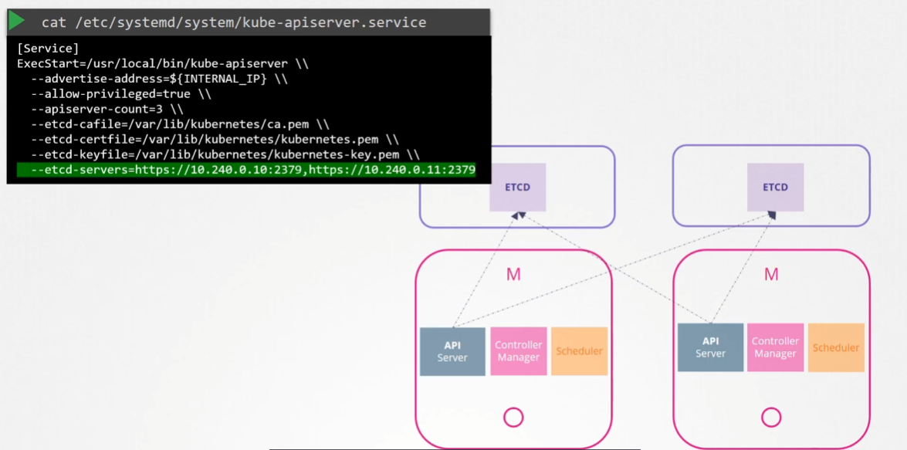

# Choosing a HA
  - Take me to [Lecture](https://kodekloud.com/topic/configure-high-availability/)

### Master Node 가 죽는다면?
Worker Node가 살아있고 Container 가 살아있다면 계속해서 실행중 일 것이고, 유저는 이 컨테이너 들에 접속 가능하다.

그러나 예를 들어 ReplicaSet 으로 정의된 Worker Node의 Pod 가 죽는다면
 Master Node 의 kube-controller, kube-scheduler 등이 없기 때문에 다시 이 Pod를 되살릴 수 없다.

> [!note]
> 그래서 실제 배포 환경에서는 SPof(Single Point of Failure) 를 제거하기 위하여 Multi Master Node가 필요하다.

## kube-apiserver

`kubectl` 같은 명령으로 kube-apiserver 에 중복된 명령을 보내면 안되기 때문에
-> Nginx, HAproxy 같은 로드밸런서를 사용.

## kube-scheduler. kube-controller-manger
이것들은 클러스터의 상태를 확인하고 조치를 취하는 컴포넌트들.
-> 얘도 중복, 병렬적으로 수행되면 안됨.

### Active, Standby using `Leader election`

#### kube-controller-manager

위에 표시된 옵션들은 모두 default

1. `--leader-elect-lease-duration` (기본값: 15초)
- **리더십 임대 유효 기간**을 정의
- 비리더 후보들이 리더 갱신을 관찰한 후 리더십 획득을 시도하기 전 대기하는 최대 시간
- 리더가 이 시간 내에 갱신하지 않으면 다른 인스턴스가 리더로 선출될 수 있음
- 수식 표현: Tlease=15sTlease​=15s

2. `--leader-elect-renew-deadline` (기본값: 10초)
- **리더 갱신 시도 제한 시간**
- 리더가 임대 갱신을 시도하는 간격으로, 이 시간 내에 갱신에 실패하면 리더십 포기
- 반드시 lease-duration보다 짧아야 함
- 수식 관계: Trenew<TleaseTrenew​<Tlease​

3. `--leader-elect-retry-period` 기본값: 2초
- **선출 재시도 주기**
- 리더 후보들이 리더십 획득을 재시도하는 주기
- 리더도 이 주기로 임대 갱신 시도를 반복
- 수식 표현: Tretry=2sTretry​=2s

> [!info]
> kube-scheduler 도 비슷하게 동작.

## ETCD
### Stacked Topology

Master Node 하나가 죽으면 ETCD 도 같이 죽음.

### External ETCD Topology

Master Node 외부에 따로 서버를 둬서 ETCD 를 올리는 방법.
보다 안전하지만 추가적인 서버가 필요하고 구성이 더 어렵다.

#### kube-apiserver with ETCD

ETCD에 도달하는 유일한 요소는 kube-apisever 이므로 kube-apiserver config 에 ETCD 서버들을 잘 적어야함.

