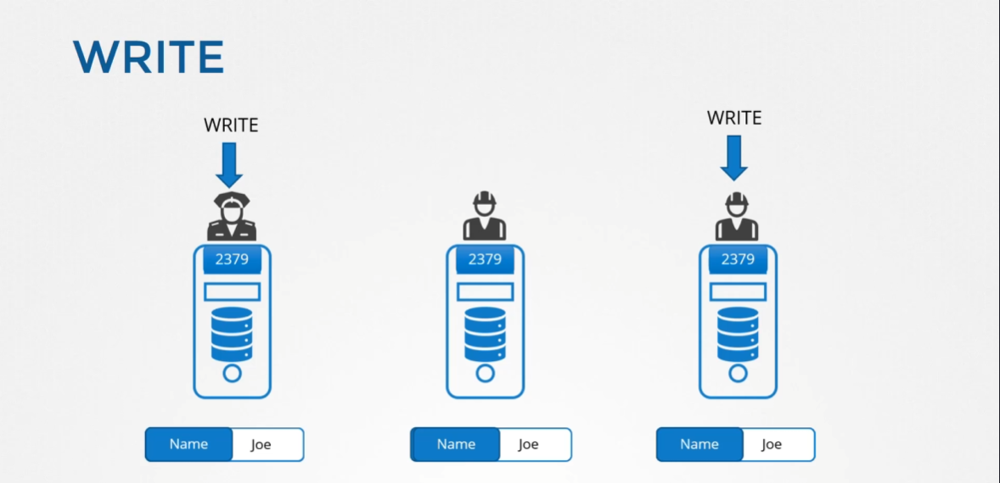
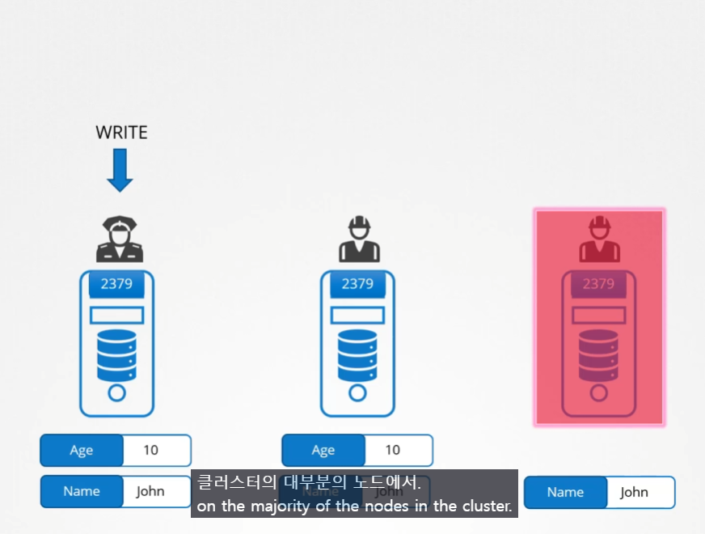
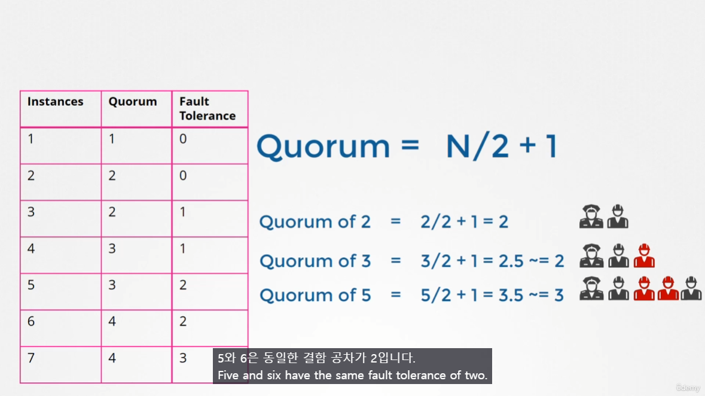
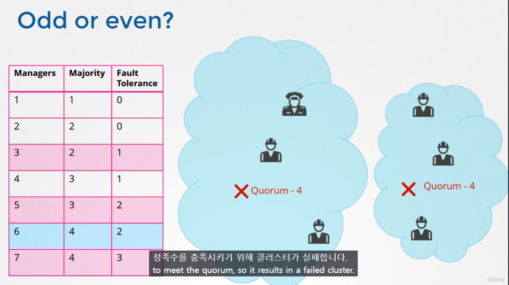
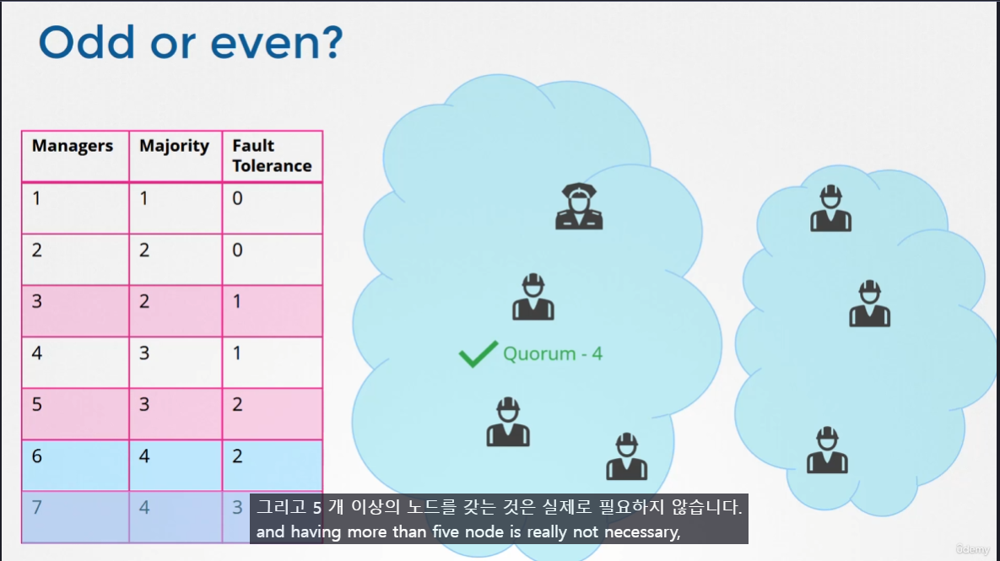
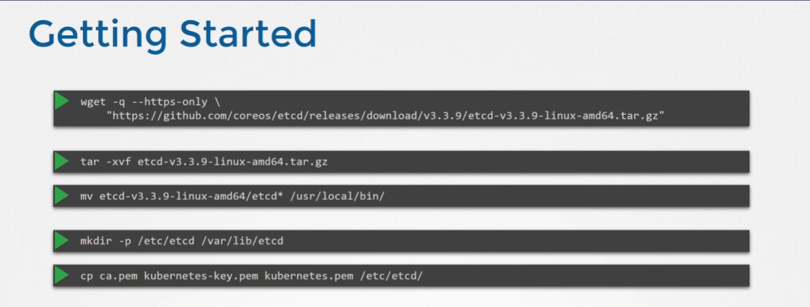
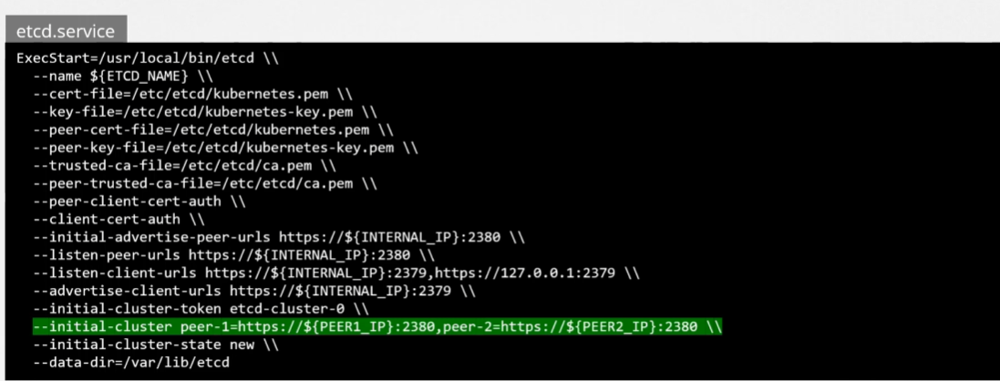
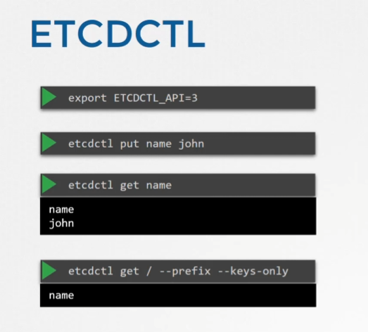

# ETCD in HA
 - Take me to [Lecture](https://kodekloud.com/topic/etcd-in-ha/)

## ETCD
ETCD는 모든 인스턴스들이 같은 데이터를 가지고 있음을 보장한다.

### Leader and Followers
#### Read
모든 ETCD 인스턴스에서 동일한 데이터를 가지고 있기 때문에 어떤 인스턴스에서 읽어도 동일한 경과가 나온다.
#### Write

Write의 경우 ETCD는 Leader 인스턴스를 하나 뽑고 나머지는 Follower 로 작용하도록 한다.
데이터를 Write 하는 것은 Leader 인스턴스에서만 가능하며, Follower 인스턴스로 쓰기 요청이 들어올 경우 이 요청을 Leader 인스턴스로 보내 Write를 처리하도록 한다.

Leader 에서 Write 가 일어날 경우 이를 Follower 로 propagte(전파) 시켜서 Follower 도 같은 데이터를 가지도록 보장한다.

# RAFT
> [!info]
> Leader 선출과 Follower 로의 데이터 전파를 가능하도록 하는 알고리즘.

## RAFT : Leader 선출

1. 각 ETCD 클러스터에서 랜덤 타이머를 가동
2. 가장 먼저 Timeout 된 인스턴스에서 다른 인스턴스에게 request 를 보내고 response를 받아 Leader 가 됨.

3. 이후에도 계속 Timer 를 돌리다가 Leader 에게서 요청이 오면 Timer 를 Reset 하고 다시 시작한다.
4. 그러나 Leader 가 죽어서 더 이상 request 가 오지 않으면 먼저 Timeout 이 되고 2번으로 돌아가 그 인스턴스가 leader가 된다.
## RAFT : 데이터 전파

Write 할 때 Qurorum(번역 : 정족수) 만큼은 쓰기가 되어야지만 Write가 정상적으로 이루어졌다고 판단함.
죽은 ETCD 인스턴스가 살아날 경우 데이터를 복원.
## Qurorum

소숫점은 버려서 계산.

Fault Tolerance 항목을 보면 Quorum을 만족시키기 위해 허용되는 죽은 인스턴스 수를 확인할 수 있다.
-> 1개 혹은 2개의 인스턴스로 ETCD 클러스터를 구성할 경우 1개만 죽어도 제대로 작동하지 않기 때문에 HA 환경에서는 최소 3개의 인스턴스는 확보하는 것을 추천.

### 홀수의 ETCD 인스턴스로 구성할 것.
Network segmentation 으로 인해 네트워크가 쪼개 질 경우 **홀수**의 인스턴스로 ETCD Cluster 를 구성하는 것이 가용성을 높이는 방법
#### 짝수일 경우 (ex.6개)

반(3:3) 으로 쪼개졌을 때 Quorom 을 만족시키지 못함.
#### 홀수일 경우 (ex.7개)

반(4:3) 으로 쪼개졌을 때 Quorom 을 만족시킴.

## ETCD 설치

`ETCDCTL` Version 3 를 사용하려면 `export ETCDCTL_API=3` 를 사용해야하는 것에 유의.

