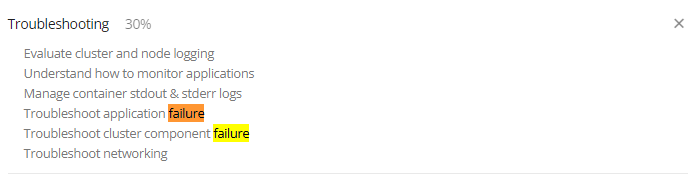

# Troubelshooting Section Introduction
## CKA

## 목차
- Application Failure
- Control Plane Failure
- Solution Control Plane Failure
- Worker Node Failure

  - Lets understand how we can troubleshoot an [Application Failure](https://kodekloud.com/topic/troubleshooting-section-introduction/).
