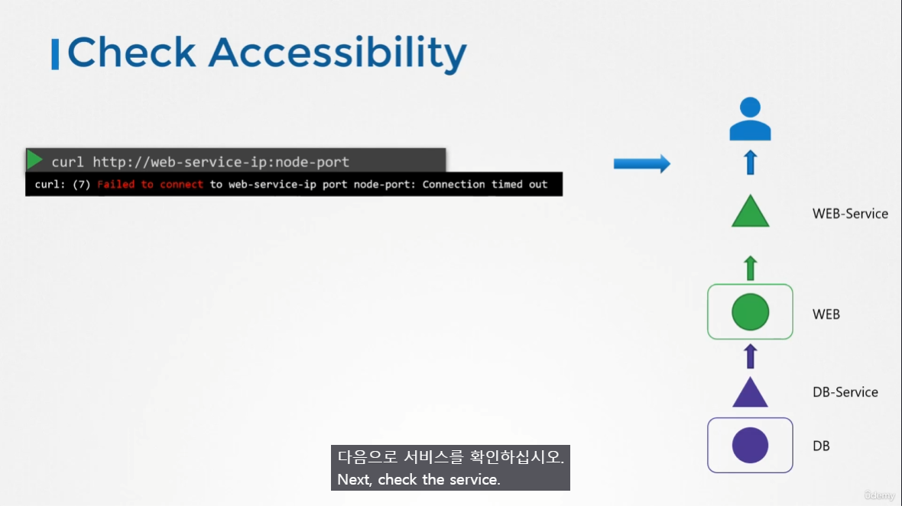

# Application Failure
  - Take me to [Lecture](https://kodekloud.com/topic/application-failure/)
  - In this lecture we will go step by step in troubleshooting Application failure.

## Debugging Tip

> [!tip]
> 위에서(Front-end)부터 차근차근 디버깅해나가며 어디에 문제가 있는지 파악!

  - To check the Application/Service status of the webserver
    ```
    curl http://web-service-ip:node-port
    ```

    

  - To check the endpoint of the service and **compare it with the selectors**
    ```
    kubectl describe service web-service
    ```   

    


  - To check the status and logs of the pod
    ```
    kubectl get pod
    ```

    ```
    kubectl describe pod web
    ```

    ```
    kubectl logs web
    ```

  - To check the logs of the previous pod
    ```
    kubectl logs web -f --previous
    ```
    
    


#### Hands on Labs
  - Lets troubleshoot the [Application](https://kodekloud.com/topic/practice-test-application-failure/)

### 참고
https://kubernetes.io/docs/tasks/debug/debug-application/