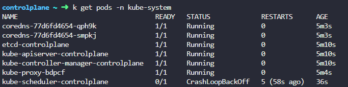

# Practice Test - Control Plane Failure
  - Lets Debug the Failure of [Control Plane](https://kodekloud.com/topic/practice-test-control-plane-failure/)

## 기본 Static Pod 컴포넌트
Kubernetes 클러스터의 컨트롤 플레인 노드에서 일반적으로 다음 컴포넌트들이 static pod로 배포됩니다[11](https://themapisto.tistory.com/135):
- etcd
- kube-apiserver
- kube-controller-manager
- kube-scheduler
### Static-pod 구별방법
Static pod는 `<pod-name>-<node-name>` 형식으로 표시됩니다.

### Static-Pod 위치
`grep staticPodPath /var/lib/kubelet/config.yaml`

# 풀이
> [!check]
> Control Component 들은 Static-pod 로 배포되는 것이 많기 때문에 이를 중심으로 check
- 1번 : kube-scheduler 수정
	- kube-scheduler는 기본적으로 static-pod 로 배포.