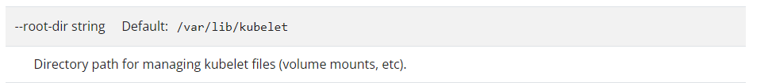

# Practice Test - Worker Node Failure
  - Lets Debug the Failure of [Worker Node](https://kodekloud.com/topic/practice-test-worker-node-failure/)

> [!check]
> Kubelet을 check

## 명령어
### `journalctl`
journalctl은 Linux 시스템에서 systemd의 로깅 기능인 journal을 조회하고 관리하는 강력한 명령어 도구.

```shell
journalctl -u kubelet
```

### `Service`

```shell
service <service-name> <options>
```

```shell
service kubelet status
```

```shell
service kubelet restart
```
**config 변경 후 항상 restart**

### `kubelet` 기본 위치 확인
두가지가 있음 :
- `/var/lib/kubelet/config.yaml`
- `/etc/kubernetes/kubelet.conf`

`/var/lib/kubelet/config.yaml`
- kubelet의 주요 구성 파일입니다[1](https://clarkshim.tistory.com/302)[4](https://kubernetes.io/ko/docs/tasks/administer-cluster/kubelet-config-file/).
- kubelet의 동작 방식, 파라미터, 설정 등을 정의합니다[5](https://velog.io/@gun_123/Cluster-Setup-and-Hardening).
- 일반적으로 kubeadm init 명령 실행 후 생성됩니다[3](https://velog.io/@sororiri/k8s-%ED%8A%B8%EB%9F%AC%EB%B8%94%EC%8A%88%ED%8C%85-kubelet-%EC%9D%B4-%EB%8F%99%EC%9E%91%ED%95%98%EC%A7%80-%EC%95%8A%EB%8A%94-%ED%98%84%EC%83%81).
- 다음과 같은 설정을 포함할 수 있습니다:
    - 네트워크 플러그인 버전
    - 클러스터 도메인
    - 클러스터 DNS
    - 인증 및 권한 부여 설정
    - 리소스 관리 설정
    

`/etc/kubernetes/kubelet.conf`
- kubelet이 API 서버와 통신하기 위한 인증 정보를 포함합니다[1](https://clarkshim.tistory.com/302).
- 주로 다음 정보를 포함합니다:
    - API 서버 엔드포인트

#### 확인방법?
`docs` 에서 옵션 확인

https://kubernetes.io/docs/reference/command-line-tools-reference/kubelet/


# 풀이
- 1번 : Worker Node 가 죽었다면 일단 kubelet 을 의심.
	- ``